# Indice

<!-- TOC -->

- [Planteamiento](#planteamiento)
- [Instalación de pfSense 2.5.1](#instalación-de-pfsense-251)
    - [Configuración de la máquina virtual](#configuración-de-la-máquina-virtual)
    - [Instalación de pfSense](#instalación-de-pfsense)
    - [Primer arranque de pfSense](#primer-arranque-de-pfsense)
- [Clientes ArchLinux](#clientes-archlinux)
    - [Instalación de pc1-arch](#instalación-de-pc1-arch)
        - [Configuración de la máquina virtual](#configuración-de-la-máquina-virtual)
        - [Instalación de ArchLinux](#instalación-de-archlinux)
        - [Exportar pcBase-arch](#exportar-pcbase-arch)
    - [Importar srv1-arch](#importar-srv1-arch)
    - [Instalar un entorno de escritorio en pc1-arch](#instalar-un-entorno-de-escritorio-en-pc1-arch)
- [Configuración inicial de pfSense](#configuración-inicial-de-pfsense)
    - [Configuración mediante la WebUI de pfSense desde pc1-arch](#configuración-mediante-la-webui-de-pfsense-desde-pc1-arch)
        - [Otras configuraciones](#otras-configuraciones)
- [Clientes del Portal Cautivo](#clientes-del-portal-cautivo)
    - [Solución de problemas](#solución-de-problemas)
- [Configuración del Portal Cautivo](#configuración-del-portal-cautivo)
    - [Configuración de DHCP lease time](#configuración-de-dhcp-lease-time)
    - [Testeo del Portal Cautivo](#testeo-del-portal-cautivo)
- [Autenticación por LDAP Directo](#autenticación-por-ldap-directo)
    - [Instalación de OpenLDAP en srv1-arch](#instalación-de-openldap-en-srv1-arch)
    - [Configuración de OpenLDAP en srv1-arch](#configuración-de-openldap-en-srv1-arch)
        - [Configuración inicial](#configuración-inicial)
            - [Configuración del cliente en el propio servidor para labores de administración](#configuración-del-cliente-en-el-propio-servidor-para-labores-de-administración)
        - [Binding DHCP estático](#binding-dhcp-estático)
        - [Creación de la entrada inicial](#creación-de-la-entrada-inicial)
    - [Instalación de jxplorer en pc1-arch](#instalación-de-jxplorer-en-pc1-arch)
    - [Inserción de usuarios desde jxplorer](#inserción-de-usuarios-desde-jxplorer)
        - [Inserción del usuario Cliente 1](#inserción-del-usuario-cliente-1)
        - [Inserción de otros usuarios en bulk](#inserción-de-otros-usuarios-en-bulk)
    - [Configuración de LDAP como servidor de usuarios en pfSense](#configuración-de-ldap-como-servidor-de-usuarios-en-pfsense)
    - [Configuración del Portal Cautivo para que autentique contra el servidor LDAP](#configuración-del-portal-cautivo-para-que-autentique-contra-el-servidor-ldap)
        - [Probamos configuración en cliente1-arch](#probamos-configuración-en-cliente1-arch)
- [Autenticación mediante freeradius](#autenticación-mediante-freeradius)
    - [Instalación de freeradius en srv1-arch](#instalación-de-freeradius-en-srv1-arch)
    - [Configuración de freeradius en srv1-arch](#configuración-de-freeradius-en-srv1-arch)
        - [Configuración del mod ldap](#configuración-del-mod-ldap)
        - [Activación del mod ldap](#activación-del-mod-ldap)
        - [Creación de claves y certificados](#creación-de-claves-y-certificados)
        - [Configuración de accesos de clientes](#configuración-de-accesos-de-clientes)
        - [Chequeo de configuración](#chequeo-de-configuración)
        - [Inicio de radiusd en modo debug](#inicio-de-radiusd-en-modo-debug)
    - [Configuración de freeradius en pfSense](#configuración-de-freeradius-en-pfsense)
        - [Comprobación de configuración correcta](#comprobación-de-configuración-correcta)
    - [Configuración del Portal Cautivo para que autentique contra el servidor RADIUS](#configuración-del-portal-cautivo-para-que-autentique-contra-el-servidor-radius)
- [Configuración de LDAPS LDAP over TLS](#configuración-de-ldaps-ldap-over-tls)
    - [Instalación de Easy-RSA](#instalación-de-easy-rsa)
    - [Creación de CA y certificados](#creación-de-ca-y-certificados)
        - [Creación de CA](#creación-de-ca)
        - [Creación de certificados para clientes](#creación-de-certificados-para-clientes)
    - [Configuración de slapd](#configuración-de-slapd)
        - [Copia de los certificados a /etc/openldap](#copia-de-los-certificados-a-etcopenldap)
        - [Configuración de slapd.conf](#configuración-de-slapdconf)
        - [Aplicación de las configuraciones](#aplicación-de-las-configuraciones)
        - [Modificación de la unit de systemd](#modificación-de-la-unit-de-systemd)
        - [Configuración de ldap.conf cliente](#configuración-de-ldapconf-cliente)
        - [Testeo de la configuración](#testeo-de-la-configuración)
    - [Configuración en pfSense](#configuración-en-pfsense)
- [Configuración de RADIUS a LDAPS](#configuración-de-radius-a-ldaps)
    - [Cambio de configuración en srv1-arch](#cambio-de-configuración-en-srv1-arch)
    - [Activación del servicio](#activación-del-servicio)
- [Separación de freeradius en srv2-arch](#separación-de-freeradius-en-srv2-arch)
    - [Importación y configuración inicial de srv2-arch](#importación-y-configuración-inicial-de-srv2-arch)
    - [Asignación de IP estática](#asignación-de-ip-estática)
    - [Instalación de FreeRADIUS](#instalación-de-freeradius)
    - [Desactivación y parada del servicio freeradius en srv1-arch](#desactivación-y-parada-del-servicio-freeradius-en-srv1-arch)
    - [Modificación de freeradius en pfSense](#modificación-de-freeradius-en-pfsense)
- [Activación de freeradius para accounting](#activación-de-freeradius-para-accounting)
    - [Configuraciones en srv1-arch](#configuraciones-en-srv1-arch)
        - [Configuración del servidor](#configuración-del-servidor)
        - [Modificación del directorio](#modificación-del-directorio)
    - [Configuraciones en srv2-arch](#configuraciones-en-srv2-arch)
    - [Configuraciones en pfSense](#configuraciones-en-pfsense)
- [Comprobación Final](#comprobación-final)
- [Conclusiones](#conclusiones)
- [Bibliografía](#bibliografía)

<!-- /TOC -->

<div style="page-break-after: always;"></div>

# Planteamiento

El objetivo de esta práctica es desplegar un portal cautivo siguiendo una estructura coherente, siendo esta una versión simplificada pero relativamente análoga a la que se podría realizar en un despliegue empresarial simple.

En este despliegue, emplearemos diferentes tecnologías, principalmente las nombradas en el título (pfSense, FreeRADIUS y OpenLDAP), siendo los dos últimos servicios y toda la infraestructura de cliente desplegada sobre sistemas Arch Linux.

Si bien, herramientas tan completas como pfSense nos permiten integrar en una única plataforma los tres componentes, al ser el objetivo de este trabajo tutelado el aprendizaje, se ha decidido implementar por separado en tres servidores distintos cada uno de estos servicios.

La memoria es un tutorial de cómo realizar esta práctica, comenta los errores que han surgido y sus soluciones, y tiene un estilo incremental, esto es: añadimos capas de complejidad sobre las que tenemos que ya funcionan adecuadamente.

<div style="page-break-after: always;"></div>

# Instalación de pfSense 2.5.1
## Configuración de la máquina virtual
Para este trabajo utilizaremos el hipervisor gratuito VirtualBox, en concreto en su última versión a fecha de escritura: `6.1.20`, con la misma revisión del Oracle VM Extension Pack.

Comenzaremos con la creación de la máquina virtual e instalación en la misma de pfSense. Para ello:

- Máquina -> Nueva *(CTRL+N)*
- Modo experto
  - Nombre *pfSense*
  - Carpeta de máquina *preferiblemente en un SSD*
  - Tipo *BSD*
  - Versión *FreeBSD (64-bit)*
  - Tamaño de  memoria *1024MB*
  - Disco duro *Crear un disco duro virtual ahora*
  - *Crear*
- Crear disco duro virtual
  - Tamaño de archivo *30GB*
  - Tipo de archivo de disco duro *VMDK*
  - Almacenamiento *Reservado dinámicamente*
  - *Crear*
- Máquina -> Configuración *(CTRL+S)*
  - General
    - Avanzado
      - Compartir portapapeles *Bidireccional*
      - Arrastrar y soltar *Bidireccional*
  - Sistema
    - Procesador
      - Procesador(es) *1* <-- Este punto es importante, ya que por alguna razón, si se le ponen más de un núcleo en virtualbox, la latencia de la primera conexión sube mucho. Es un error curioso, pero con un núcleo los tiempos pasan a ser tolerables.
  - Almacenamiento
    - *Seleccionamos el disco óptico*
    - Cargamos la ISO `pfSense-CE-2.5.1-RELEASE-amd64.iso`
  - Red
    - Adaptador 1
      - Habilitar adaptador de red *[x]*
      - Conectado a *Adaptador Puente*
      - Avanzadas
        - Tipo de adaptador *Intel PRO/1000 MT Desktop (82540EM)*
    - Adaptador 2
      - Habilitar adaptador de red *[x]*
      - Conectado a *Red interna*
      - Nombre de red *intnet*
      - Avanzadas
        - Tipo de adaptador *Intel PRO/1000 MT Desktop (82540EM)*
    - Adaptador 3
      - Habilitar adaptador de red *[x]*
      - Conectado a *Red interna*
      - Nombre de red *captivenet*
      - Avanzadas
        - Tipo de adaptador *Intel PRO/1000 MT Desktop (82540EM)*
  - *Aceptar*

## Instalación de pfSense
Iniciamos la máquina y en seleccionar disco de inicio seleccionamos la ISO de pfSense que cargamos anteriormente.

En los diálogos siguientes actuamos tal que:
- **A**ccept
- **I**nstall -> **O**K
- Seleccionamos el keymap que se adecúe al nuestro, en mi caso es US, así que podemos darle a *>>> Continue with default keymap* -> **S**elect
- **A**uto (UFS) BIOS -> **O**K

Esperamos pacientemente a que se instale (no debería tardar mucho)...
Cuando haya terminado nos preguntará si queremos abrir un shell para realizar otras modificaciones al sistema, a lo que respondemos:
- **N**o
- **R**eboot

Antes de que se inicie el sistema de nuevo, deberemos ir *rápidamente* en el menú de VirtualBox a Dispositivos -> Unidades ópticas -> Eliminar disco de la unidad virtual. Si no da tiempo, no hay mayores problemas, simplemente esperamos a que arranque, quitamos el DVD, y reiniciamos la máquina en Máquina -> Reiniciar.

## Primer arranque de pfSense
Al arrancar podremos ver una terminal de texto plano desde la que realizar tareas básicas. Esto es así ya que muchas de las tareas más complejas se realizarán desde la GUI web.

Como podemos observar, tenemos dos interfaces, `WAN` y `LAN`. La primera es el adaptador a NAT de VirtualBox, y la segunda será la que usaremos como la boca a nuestra red interna. Los nombres em0 y em1 indican que son tarjetas de red que funcionan con el driver intel. Además, nos interesa tener una tercera interfaz, por la que crearemos el portal cautivo, llamada `OPT1`. Para esto, tendremos que configurar las interfaces:
- **1**
- **n**
- *em0*
- *em1*
- *em2*
- **y**

De esta forma, las interfaces quedarán configuradas de forma estática tal que
- WAN  -> em0 
- LAN  -> em1

y veremos la siguiente salida:

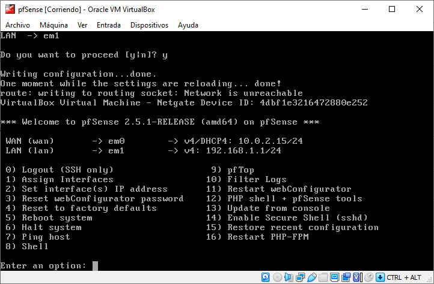

<div style="page-break-after: always;"></div>

# Clientes ArchLinux
Para configurar pfSense necesitaremos acceder desde LAN al servidor, por lo que debemos crear varias máquinas cliente. La distribución elegida es ArchLinux, la cual también usaremos para alojar el servidor LDAP.

## Instalación de pc1-arch
### Configuración de la máquina virtual
- Máquina -> Nueva *(CTRL+N)*
- Modo experto
  - Nombre *pc1-arch*
  - Carpeta de máquina *preferiblemente en un SSD*
  - Tipo *Linux*
  - Versión *Arch Linux (64-bit)*
  - Tamaño de  memoria *2048MB*
  - Disco duro *Crear un disco duro virtual ahora*
  - *Crear*
- Crear disco duro virtual
  - Tamaño de archivo *30GB*
  - Tipo de archivo de disco duro *VMDK*
  - Almacenamiento *Reservado dinámicamente*
  - *Crear*
- Máquina -> Configuración *(CTRL+S)*
  - General
    - Avanzado
      - Compartir portapapeles *Bidireccional*
      - Arrastrar y soltar *Bidireccional*
  - Sistema
    - Procesador
      - Procesador(es) *2*
  - Almacenamiento
    - *Seleccionamos el disco óptico*
    - Cargamos la ISO `archlinux-2021.04.01-x86_64.iso`
  - Red
    - Adaptador 1
      - Habilitar adaptador de red *[x]*
      - Conectado a *Red interna*
      - Nombre de red *intnet*
      - Avanzadas
        - Tipo de adaptador *Intel PRO/1000 MT Desktop (82540EM)*
  - *Aceptar*

### Instalación de ArchLinux
Iniciamos la máquina y en seleccionar disco de inicio seleccionamos la ISO de ArchLinux que cargamos anteriormente.

En el menú Syslinux seleccionamos la primera opción
- Arch Linux install medium (x86_64, BIOS)

Mediante el script de AutoHotKey autotecleamos el siguiente script en Arch para realizar la instalación. Por ejemplo le llamaremos `install`:
```bash
#!/bin/bash

# exit on failure
set -e

timedatectl set-ntp true

# Escribimos el script
cat << EOS > partition.sfdisk
label: dos
label-id: 0x27e2bcd8
device: /dev/sda
unit: sectors
sector-size: 512

/dev/sda1 : start=2048, size=62912512, type=83, bootable
EOS

# Lo ejecutamos para particionar el disco
sfdisk /dev/sda < partition.sfdisk

# Creamos el sistema de ficheros
mkfs.ext4 -F /dev/sda1

mount /dev/sda1 /mnt

# Instalamos el sistema
pacstrap /mnt linux linux-firmware base base-devel nano grub bmon htop

genfstab -U /mnt >> /mnt/etc/fstab

echo "LANG=en_US.UTF-8" > /mnt/etc/locale.conf
echo "KEYMAP=en_US.UTF-8" > /mnt/etc/vconsole.conf
echo "pc1-arch" > /mnt/etc/hostname

cat << EOS >> /mnt/etc/hosts

127.0.0.1 localhost
::1       localhost
127.0.1.1	pc1-arch.tt1.pri pc1-arch
EOS

cat << EOS >> /mnt/etc/systemd/network/20-wired.network
[Match]
Name=enp0s3

[Network]
DHCP=ipv4
EOS

cat << EOS > /mnt/chroot-steps.sh
#!/bin/bash

set -e

ln -sf /usr/share/zoneinfo/Europe/Madrid /etc/localtime
hwclock --systohc

sed -i '/#en_US.UTF-8 UTF-8/s/^#//g' /etc/locale.gen
locale-gen
grub-install --target=i386-pc /dev/sda
grub-mkconfig -o /boot/grub/grub.cfg

useradd -m pc
echo 'root:pc' | chpasswd
echo 'pc:pc' | chpasswd

sed -i '/# %wheel ALL=(ALL) NOPASSWD: ALL/s/^# //g' /etc/sudoers

# Hacemos a pc sudoer
usermod -aG wheel,audio,video,optical,storage pc

# Activamos la red
systemctl enable systemd-networkd systemd-resolved
EOS

chmod +x /mnt/chroot-steps.sh

arch-chroot /mnt /chroot-steps.sh

rm /mnt/chroot-steps.sh

poweroff
```

y lo ejecutamos con `bash install`

No nos hemos dado cuenta, pero realizando esta instalación ya hemos probado que el pfsense funciona, ya que Arch Linux solo se instala desde red, y la máquina que da red a la red interna es, efectivamente, la de pfSense.

Esto lo podemos probar de varias maneras, como haciendo ping a `gnu.org`, mirando la IP, puerta de enlace, etc, como se muestra en la siguiente imagen:

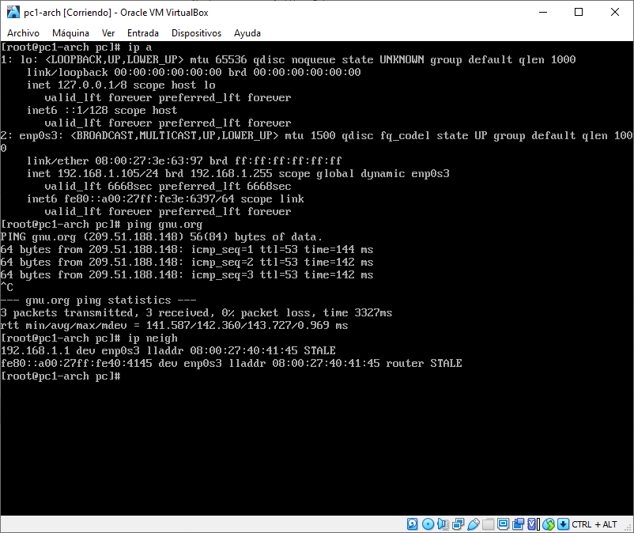

### Exportar pcBase-arch
Seleccionamos la máquina `pc1-arch` y procedemos tal que:
- Archivo
  - Exportar servicio virtualizado *(CTRL+E)*
    - Formato *Open Virtualization Format 2.0*
    - Política de direcciones MAC *Quitar todas las direcciones MAC*
    - Nombre *pcBase-arch*
  - *Exportar*

Recordemos que a pesar de ser este el sistema base, lo creamos a partir de pc1, y por tanto hemos de editar `/etc/hostname` y `/etc/hosts` para otras copias del mismo. 

## Importar srv1-arch
Ahora vamos a importar el servidor, donde hostearemos el servidor LDAP. Para ello:
- Archivo
  - Importar servicio virtualizado *(CTRL+I)*
    - Modo experto
    - Fuente: *seleccionamos la .ova que hemos guardado previamente*
    - Carpeta base de la máquina *como prefiramos, pero de nuevo, recomendable SSD*
    - Política de dirección MAC *Generar nuevas direcciones MAC*
    - Importar discos como VDI *[  ]*
    - *Importar*
- Seleccionamos el nuevo servicio importado, y le cambiamos el nombre de *pcBase-arch* a *srv1-arch*

Iniciamos *srv1-arch*, e iniciamos sesión con `pc:pc`. Tras eso editamos los archivos relacionados con el hostname con
```bash
sudo sed -i 's/pc1-arch/srv1-arch/g' /etc/hostname
sudo sed -i 's/pc1-arch/srv1-arch/g' /etc/hosts
sudo rm /etc/machine-id
```

Es importante la última línea, ya que si nuestra machine-id coincide, vamos a tener todo tipo de conflictos, por ejemplo con la IP en los DHCP. Tras eso reiniciamos (por ejemplo con `sudo reboot`).

## Instalar un entorno de escritorio en pc1-arch
Para evitarnos problemas, ya que se ha detectado que los primeros mirrors de la ISO a momento de realización del trabajo no están funcionando correctamente, se propone actualizar la mirrorlist con:
```bash
sudo pacman -S reflector
sudo reflector --verbose --latest 5 --protocol https --sort rate \
--save /etc/pacman.d/mirrorlist
sudo pacman -Syy
```

Para instalar un entorno de escritorio en Arch Linux es realmente sencillo, únicamente debemos tener acceso a internet y ejecutar el siguiente comando, pulsando \<ENTER\> ante cualquier diálogo (acepta por defecto).
```bash
sudo pacman -S lxqt papirus-icon-theme sddm virtualbox-guest-utils \
noto-fonts firefox
sudo systemctl enable vboxservice.service sddm
sudo reboot
```

En Arch Linux hay que configurar las cosas manualmente, así que tenemos que habilitar el pack de iconos que hemos instalado. Para eso vamos al menú de inicio y:
- Preferences
  - LXQt Settings
    - Appearance
      - Icons Theme: *Papirus-Dark*

Tras esto reiniciamos, o cerramos sesión y volvemos a iniciarla para reiniciar X.

<div style="page-break-after: always;"></div>

# Configuración inicial de pfSense
## Configuración mediante la WebUI de pfSense desde pc1-arch
Ahora vamos al Menú de Inicio -> Internet -> Firefox, lo abrimos, y nos dirigimos a la dirección 192.168.1.1, lo cual nos mostrará una pantalla como la siguiente:

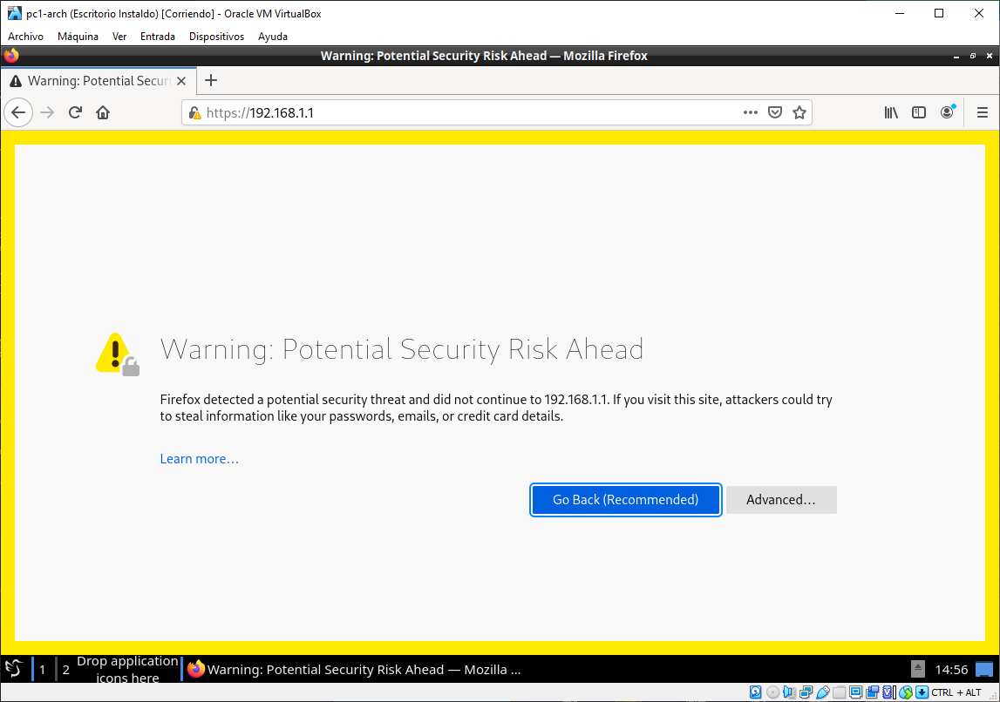

Esto es producido porque pfSense está utilizando un certificado autofirmado, pero no hay mayor problema en usarlo así. Para continuar haremos click en *Advanced* -> *Accept the Risk and Continue*. Tras continuar veremos la webUI de pfSense, introduciremos las credenciales `admin:pfsense`:

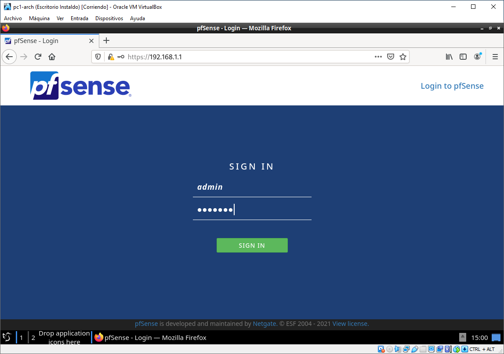

Como podemos imaginar, esto de que la contraseña sea la que viene por defecto, no es precisamente una buena práctica de seguridad, por lo que nos tocará cambiarla. Aprovechando el Warning que nos sale, haremos click en *Change the password in the User Manager*, como se muestra en la imagen siguiente:

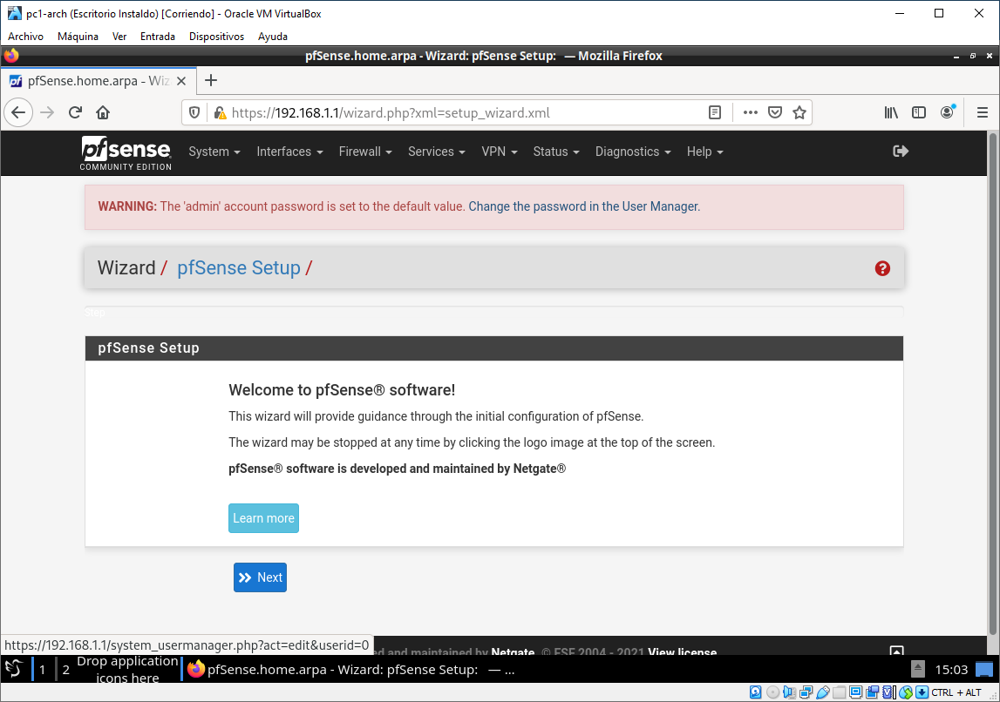

La nueva contraseña a efectos de demostración, y que evidentemente no debe ser usada en produccion por su sencilleza será `pc1234`. Tras esto bajamos al final de la página y hacemos click en 💾 *Save*.

Una vez guardado iremos a la parte superior derecha de la página para hacer *logout* y volveremos a iniciar sesión con las nuevas credencias `admin:pc1234`. Esto nos debería dejar en la siguiente pantalla: el Dashboard.

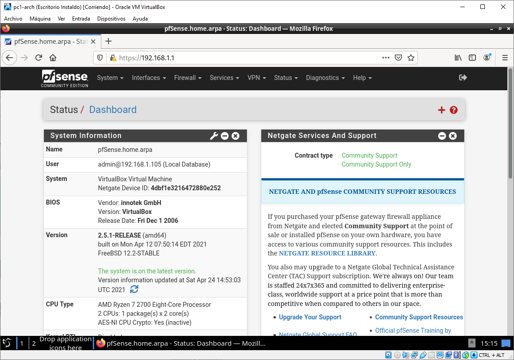

Ahora vamos a configurar la red con portal cautivo en la interfaz `OPT1`. Para ello nos dirigiremos en el menú web de pfSense a:
- Interfaces
  - OPT1
    - General Configuration
      - Enable [x] *Enable Interface*
      - IPv4 Configuration Type *Static IPv4*
      - IPv6 Configuration Type *None*
    - Static IPv4 Configuration
      - IPv4 Address *192.168.2.1* / *24*
  - 💾 *Save*

Configuramos el servidor DHCP
- Services
  - DHCP Server
    - *OPT1*
      - General Options
        - Enable [x] *Enable DHCP server on OPT1 interface*
        - Range
          - From *192.168.2.100*
          - To *192.168.2.199*
  - 💾 *Save*

Y las reglas del Firewall, las cuales tenemos que copiar de la interfaz LAN, como se ve en la imagen a continuación:

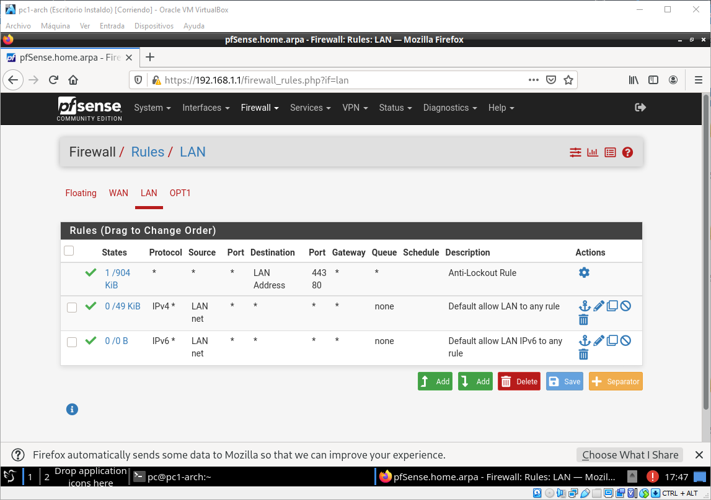

- Firewall
  - Rules
    - OPT1
      - Add
        - Edit Firewall Rule
          - Protocol *Any*
        - Source
          - Source *OPT1 net*
      - 💾 *Save*
      - Add
        - Edit Firewall Rule
          - Address Family *IPv6*
          - Protocol *Any*
        - Source
          - Source *OPT1 net*
      - 💾 *Save*
  - *Apply Changes*


Con esto ya estaría configurado el acceso a internet sin restricciones en la interfaz secundaria, donde configuraremos el portal cautivo. Tras ello crearemos un par de máquinas virtuales para testear la conexión por `OPT1`, y que posteriormente pasarán por el portal cautivo.

### Otras configuraciones
Además, un par de configuraciones que teníamos pendientes son las siguientes:
- System
  - General Setup
    - System
      - Domain *tt1.pri*
    - DNS Server Settings
      - DNS Servers *8.8.8.8*
      - DNS Servers *1.0.0.1*
      - DNS Server Override [ ] *Allow DNS server list to be overridden by DHCP/PPP on WAN*
    - Localization
      - Timezone *Europe/Madrid*
  - 💾 *Save*

- DNS Forwarder
  - General DNS Forwarder options
    - Enable [x] *Enable DNS forwarder*
    - DHCP Registration [x] *Register DHCP leases in DNS forwarder*
    - Static DHCP [x] *Register DHCP static mappings in DNS forwarder*
    - Interfaces *Seleccionamos LAN y OPT1 con CTRL*

<div style="page-break-after: always;"></div>

# Clientes del Portal Cautivo
Para crear los clientes importaremos dos veces pcBase-arch, como se especifica en [Importar srv1-arch](##Importar-srv1-arch).

Los nombraremos `cliente1-arch` y `cliente2-arch`, les cambiaremos la red interna a `captivenet`, e [instalaremos el entorno de escritorio](##Instalar-un-entorno-de-escritorio-en-pc1-arch)

Copypaste para cliente1
```bash
sudo sed -i 's/pc1-arch/cliente1-arch/g' /etc/hostname
sudo sed -i 's/pc1-arch/cliente1-arch/g' /etc/hosts
sudo rm /etc/machine-id
sudo reboot
```

y para cliente2
```bash
sudo sed -i 's/pc1-arch/cliente2-arch/g' /etc/hostname
sudo sed -i 's/pc1-arch/cliente2-arch/g' /etc/hosts
sudo rm /etc/machine-id
sudo reboot
```

Tras esto podremos confirmar que tenemos acceso a internet, como se ve en la imagen:

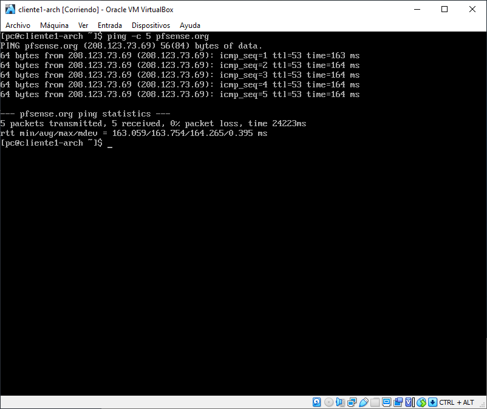

<div style="page-break-after: always;"></div>

## Solución de problemas
De todos modos, en este punto que ya estamos probando la conexión a internet, nos estamos dando cuenta de que va estúpidamente lenta al comienzo, como si el firewall se estuviese interponiendo, o algo estuviese previniendo las primeras conexiones funcionar bien, por lo que decidimos cambiar la interfaz principal de pfSense de *NAT* a *Adaptador Puente*, y bajamos las CPUs de la máquina virtual de 2 a 1, como ya aparecen actualizados en la [configuración de la máquina pfSense](###Configuración-de-la-máquina-virtual). También nos damos cuenta de que 4GB de RAM son innecesarios, y le bajamos a 1GB.

Por otro lado, parecía que el DNS Forwarder que tambien hemos configurado previamente para descartar posibles "puntos lentos", no esté funcionando de forma adecuada, lo cual se puede solventar eliminando las cachés de systemd-resolved, con el comando `sudo systemd-resolve --flush-caches`. Tras esto y como estamos en un escenario de pruebas, vamos a dejar activo el DNS Forwarder, ya que parece que el rendimiento de la red mejora un montón con respecto al DNS server, y aún por encima nos permite direccionar los hosts por DHCP, que es prácticamente todo lo que necesitamos con respecto al DNS para este trabajo.

Con todas estas configuraciones intentando corregir el error comentado anteriormente de la baja velocidad que se obtiene, parece que efectivamente se ha solucionado el problema.

<div style="page-break-after: always;"></div>

# Configuración del Portal Cautivo
Para configurar un portal cautivo básico es realmente sencillo, debemos acceder a la interfaz web de pfSense y dirigirnos a:
- Services
  - Captive Portal
    - Add
      - Zone name *clientes*
      - Zone description *Portal cautivo para los clientes de la red OPT1*

Una vez creado el portal cutivo, nos lleva a la página de configuración del mismo, en el que vemos el siguiente aviso:

```Don't forget to enable the DHCP server on the captive portal interface! Make sure that the default/maximum DHCP lease time is higher than the hard timeout entered on this page. Also, the DNS Forwarder or Resolver must be enabled for DNS lookups by unauthenticated clients to work.```

Como en nuestro caso ya tenemos habilitado el DHCP en la interfaz OPT1, solamente tendremos que prestar atención a la segunda parte del mensaje más adelante.

- Hacemos click en *Enable Captive Portal*
  - Interaces *OPT1*
  - Maximum concurrent connections *100*
  - Idle timeout *60*
  - Hard timeout *240*

Tenemos muchos más ajustes disponibles, como por ejemplo logos personalizados (donde podríamos poner el logo de nuestra empresa... etc)

En Authentication
  - Authentication Method: por el momento pondremos *None, don't authenticate users*, ya que esta es una primera aproximación, y querremos verificar que funciona. Posteriormente usaremos RADIUS.

Y bajamos al fondo de la página, donde presionamos 
  - 💾 *Save*

## Configuración de DHCP lease time
Ahora tenemos que ir a configurar la segunda parte del mensaje, el DHCP lease time, que no puede ser menor que el Hard timeout del portal cautivo. Para ello:
- Services
  - DHCP Server
    - OPT1
      - Other Options
        - Default lease time *14400*
    - 💾 *Save*  

## Testeo del Portal Cautivo
Y para probar que funciona, volveremos a uno de los dos clientes, abriremos Firefox, e intentaremos acceder a cualquier página web. Si todo va bien, pfSense nos interceptará y pedirá logueo, que en nuestro caso básico será únicamente un botón de login sin credenciales, como se ve en la imagen siguiente:

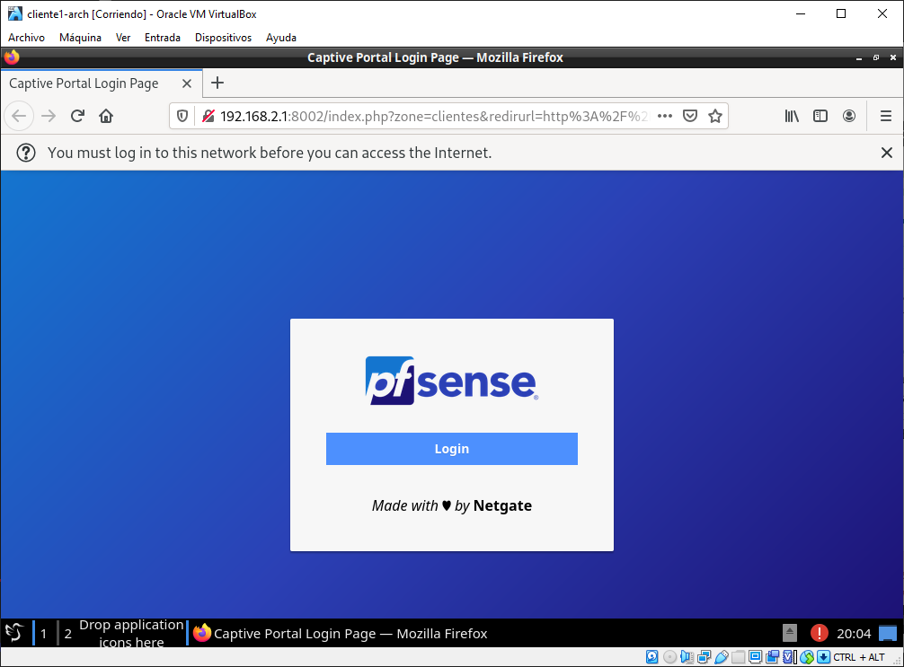

A parte de poder efectivamente ver que funciona internet, si accedemos a
- Status
  - Captive Portal

podremos ver los usuarios logueados, como se ve en la imagen a continuación:

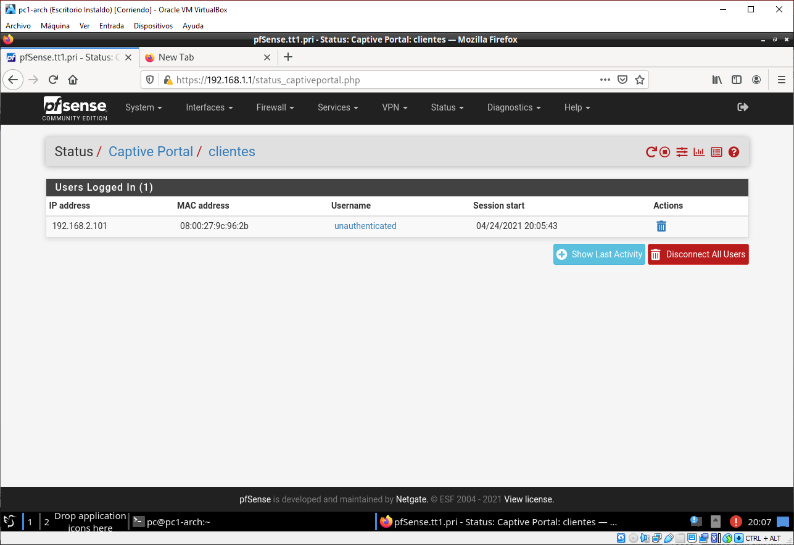

<div style="page-break-after: always;"></div>

# Autenticación por LDAP Directo
Como estamos aplicando un enfoque incremental a lo largo de la realización de este trabajo, primero haremos que pfSense comunique directamente con el servidor openldap, para posteriormente introducir RADIUS de por medio. 

## Instalación de OpenLDAP en srv1-arch
Para instalar OpenLDAP en el servidor procederemos con los siguientes comandos:

```bash
sudo pacman -S openldap
```

## Configuración de OpenLDAP en srv1-arch
### Configuración inicial
Ahora procederemos a configurar el servidor openldap. Por comodidad los siguentes comandos se ejecutan como root (`sudo su`).

La configuración de servidor de openldap se encuentra en `/etc/openldap/slapd.conf`. La editaremos tal que:
- Cambiamos el campo `suffix` a `"dc=tt1,dc=pri"`. Esto indica nuestro sufijo, que suele ser (y en nuestro caso es) el dominio.
- El campo `rootdn` a `"cn=root,dc=tt1,dc=pri"`. Esta línea indica básicamente el administrador, el cual en nuestro caso será root.
- Al inicio del fichero, en la zona de includes añadiremos
```
include         /etc/openldap/schema/cosine.schema
include         /etc/openldap/schema/inetorgperson.schema
include         /etc/openldap/schema/nis.schema
```

Tras realizar todo esto guardamos, y ejecutaremos los siguientes comandos, el primero para eliminar la contraseña de root actual, y el segundo para escribir al archivo la password hasheada de root. De nuevo, esta no destaca por su complejidad, pero es solamente a efectos de demostración.
```bash
sed -i "/rootpw/ d" /etc/openldap/slapd.conf
echo "rootpw     $(slappasswd -s pc1234)" >> /etc/openldap/slapd.conf
```

Preparamos el directorio de la base de datos con
```bash
cp /var/lib/openldap/openldap-data/DB_CONFIG.example /var/lib/openldap/openldap-data/DB_CONFIG
```

Iniciamos slapd para crear la base de datos, y nada más iniciar, lo paramos.
```bash
systemctl start slapd
systemctl stop slapd
```

Ejecutamos los siguientes comandos para poblar `/etc/openldap/slapd.d`
```bash
rm -rf /etc/openldap/slapd.d/*
sudo -u ldap slaptest -f /etc/openldap/slapd.conf -F /etc/openldap/slapd.d/
```

Y activamos slapd, además de iniciarlo.
```bash
systemctl enable --now slapd
```

#### Configuración del cliente en el propio servidor (para labores de administración)
Para esto configuraremos el archivo `/etc/openldap/ldap.conf`
- Descomentamos el campo `BASE` y lo ponemos a `"dc=tt1,dc=pri"`.
- Descomentamos el campo `URI` y lo ponemos a `ldap://192.168.1.200 ldap://192.168.1.200:666`


### Binding DHCP estático
Ahora tenemos un problema: Nuestra IP se obtiene por DHCP, así que por el momento y en este caso únicamente, tenemos la IP .106, por lo que hay que realizar una configuración de IP estática. Para esto podemos editar el archivo `/etc/systemd/network/20-wired.network`, pero como nos sigue interesanto utilizar DHCP, otra cosa que podemos hacer es realizar un binding estático de DHCP. 

Desde la webUI de pfSense vamos a:
- Services
  - DHCP Server
    - LAN
      - DHCP Static Mappings for this Interface
        - Add
          - MAC Address (la MAC de `srv1-arch`). En mi caso *08:00:27:C4:3B:B1*
          - Client Identifier. No es muy relevante, pero en mi caso pondré *Servidor 1 Arch*
          - IP address *192.168.1.200*
          - Hostname *srv1-arch*
        - 💾 *Save*  
      - *Apply Changes*

Ahora en `srv1-arch` reiniciamos la red con `sudo systemctl restart systemd-networkd`


### Creación de la entrada inicial
Ahora que tenemos iniciado el servicio, y el cliente está configurado, podemos crear la entrada inicial, así como el grupo de usuarios. Para ello creamos el el siguiente archivo `firstent.ldif`:
```ldif
dn: dc=tt1,dc=pri
objectClass: dcObject
objectClass: organization
dc: tt1
o: tt1
description: TT1 directory

dn: cn=root,dc=tt1,dc=pri
objectClass: organizationalRole
cn: root
description: TT1 Directory Manager

dn: ou=users,dc=tt1,dc=pri
objectClass: organizationalUnit
objectClass: top
ou: users
```

Y realizamos la transacción con el comando:
```bash
ldapadd -c -x -D 'cn=root,dc=tt1,dc=pri' -W -f firstent.ldif
```

Introducimos la contraseña de LDAP `pc1234` y aceptamos.

## Instalación de jxplorer en pc1-arch
Para instalar jxplorer: el software que usaremos para gestionar el servidor LDAP, necesitaremos bajar su paquete del AUR (Arch User Repository), para lo cual no es necesario pero sí conveniente un AUR helper. En esta ocasión utilizaremos `yay`.

Para instalar yay, procederemos tal que:
```bash
sudo pacman -S git
git clone https://aur.archlinux.org/yay-bin.git
cd yay-bin
makepkg -sri
cd ..
sudo rm -rf yay-bin
```

Y tras tener yay instalado, procederemos a instalar jxplorer y java. En el diálogo que nos pregunta `Remove make dependencies after install? [y/N]`, respondemos que si [`y`]. Tras eso simplemente pulsamos \<ENTER\> para aceptar todo por defecto.
```bash
yay -S jdk8-openjdk jxplorer
```

## Inserción de usuarios desde jxplorer
Para testear el correcto funcionamiento del servidor LDAP, vamos a insertar un usuario a mano en jxplorer.

Nos dirigiremos a jxplorer en `pc1-arch` -> File -> Connect
- Host *192.168.1.200*
- Base DN *dc=tt1,dc=pri*
- Security
  - Level: *User + Password*
  - User DN: *cn=root,dc=tt1,dc=pri*
  - Password: *pc1234*

Si lo creemos conveniente podemos guardar el perfil. En nuestro caso lo haremos.

### Inserción del usuario Cliente 1
Para insertar el usuario Cliente 1, y una vez estamos autenticados, nos dirigiremos a users, le daremos click derecho, new, y rellenaremos los siguientes datos, como también se muestra en la imagen posterior para Cliente 2.

- Parent DN: *ou=users,dc=tt1,dc=pri* (este ya debería venir automáticamente)
- Enter RND: *cn=Cliente 1*
- Selected Classes: *organizationalPerson*, *person*, *top*

Y pulsamos *OK*

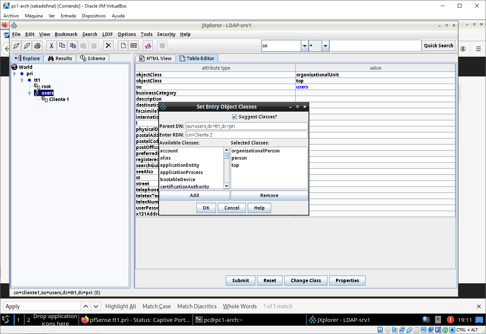

En el formulario que se nos abre, deberemos rellenar:
- **sn**: *cliente1* (surname, a pesar de que en nuestro contexto un apellido no tiene mucho sentido, aprovecharemos para poner el nombre de usuario, ya que es obligatorio cumplimentar este campo)
- **userPassword**: `cliente1` (la contraseña será *cliente+"número de cliente"*)
  - Algoritmo de cifrado *MD5*

Tras esto pulsamos en *Submit*.

### Inserción de otros usuarios en bulk
Como vemos que ha funcionado, ahora vamos a insertar una mayor base de datos en bulk con un fichero ldif.

Escribimos el script que escriba el fichero `users.ldif`. En este caso le llamaremos `createusers.sh`, y lo usaremos para crear los usuarios del 2 al 100.
```bash
#!/bin/bash

echo -n > users.ldif

for i in {2..100}; do
  echo dn: cn=Cliente $i,ou=users,dc=tt1,dc=pri >> users.ldif
  echo objectClass: organizationalPerson >> users.ldif
  echo objectClass: person >> users.ldif
  echo objectClass: top >> users.ldif
  echo sn: cliente${i} >> users.ldif
  echo userPassword: $(slappasswd -h {MD5} -s cliente$i) >> users.ldif
  echo cn: Cliente $i >> users.ldif
  echo "" >> users.ldif
done  
```

Y lo ejecutamos con `bash createusers.sh`

Tras escribir el comando lo ejecutamos con
```bash
ldapadd -c -x -D 'cn=root,dc=tt1,dc=pri' -W -f users.ldif
```

## Configuración de LDAP como servidor de usuarios en pfSense
En la web UI de pfSense vamos a:
- System
  - User Manager
    - Authentication Servers
      - Add
        - Server Settings
          - Descritptive name *Servidor OpenLDAP en srv1-arch*
          - Type *LDAP*
        - LDAP Server Settings
          - Hostname or IP address *192.168.1.200*
          - Transport *Standard TCP* Por el momento vamos a usar TCP estándar. En una próxima iteración configuraremos TLS en el servidor OpenLDAP para que todo el tráfico vaya encriptado.
          - Level *Entire Subtree*
          - Base DN *dc=tt1,dc=pri*
          - Authentication containers *ou=users,dc=tt1,dc=pri*
          - Bind anonymous [ ]
            - Bind credentials *cn=root,dc=tt1,dc=pri* , *pc1234*
          - User naming attribute *sn*
          - UTF8 Encode [x] UTF8 encode LDAP parameters before sending them to the server.
      - 💾 *Save*

## Configuración del Portal Cautivo para que autentique contra el servidor LDAP
En la web UI de pfSense:
- Services
  - Captive Portal
    - Clientes -> Edit (✏️)
      - Authentication
        - Authentication Method
          - Use an Authentication backend
        - Authentication Server
          - *Servidor OpenLDAP en srv1-arch*
        - Secondary authentication Server
          - *lo dejamos vacío*
      - 💾 *Save*

### Probamos configuración en cliente1-arch
Para probar que funciona, volveremos a uno de los dos clientes, abriremos Firefox, e intentaremos acceder a cualquier página web. pfSense nos intercepta y pide esta vez logueo, pero esta vez con credenciales. En ella cumplimentamos los datos, como se ve en la imagen siguiente:

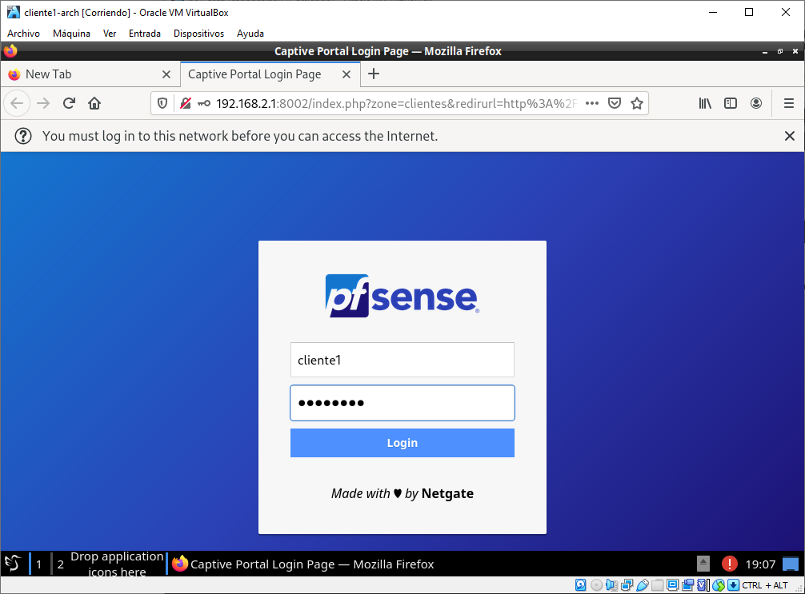

Y como podremos observar, Firefox nos muestra un mensaje de `success`, y ya podremos navegar por Internet.

Además, si vamos a
- Status
  - Captive Portal

Podremos ver la sesión recién iniciada por cliente1.

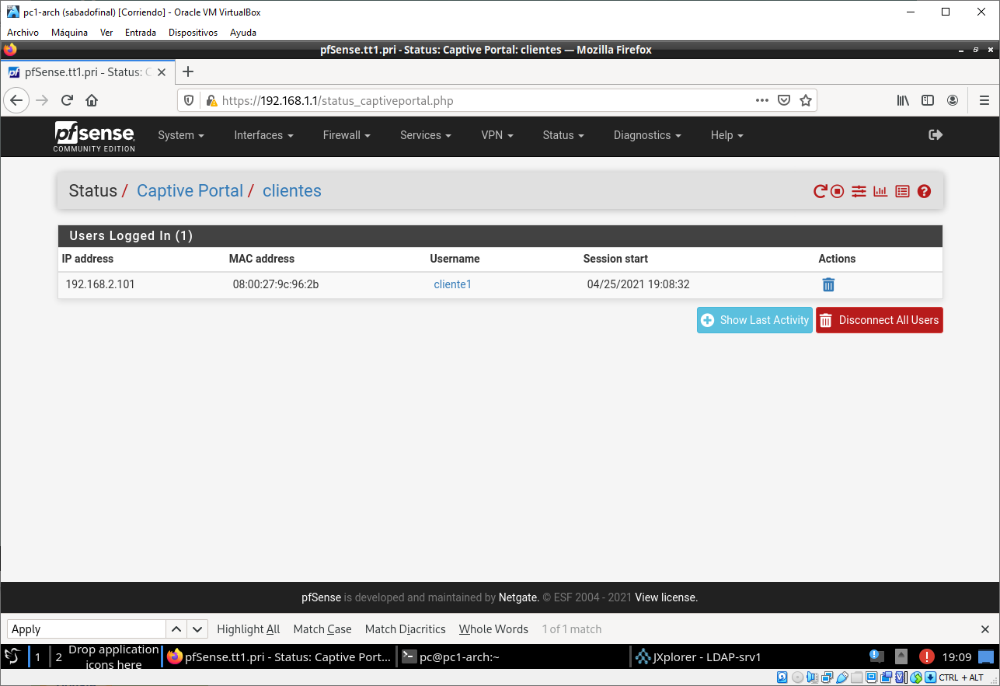

<div style="page-break-after: always;"></div>

# Autenticación mediante freeradius
## Instalación de freeradius en srv1-arch
Primeramente deberemos instalar el paquete freeradius de los repositorios oficiales de Arch Linux con:

```bash
sudo pacman -S freeradius
```

## Configuración de freeradius en srv1-arch
Tras esto nos hacemos root (`sudo su`) y realizamos las siguientes ediciones:

### Configuración del mod ldap
En `/etc/raddb/mods-available/ldap`:
- Verificamos que el campo `server` = `localhost`
- Descomentamos y modificamos el campo `identity` = `'cn=root,dc=tt1,dc=pri'`
- Descomentamos y modificamos el campo `password` = `'pc1234'`
- Modificamos el campo `base_dn` = `'ou=users,dc=tt1,dc=pri'`
- Buscamos por `user {`, y nos llevará a la primera (y única) coincidencia de la definición del *user object identification*
  - Modificamos el campo `filter` = `"(sn=%{%{Stripped-User-Name}:-%{User-Name}})"`, en concreto cambiamos `uid` por `sn`

### Activación del mod ldap
Continuamos activando el módulo con
```bash
ln -s /etc/raddb/mods-available/ldap /etc/raddb/mods-enabled/ldap
```

### Creación de claves y certificados
Creamos los certificados, claves dh, etc, con
```bash
cd /etc/raddb/certs
sudo -u radiusd make
```
y esperamos pacientemente a que se complete...

### Configuración de accesos de clientes
Tenemos que configurar para que se pueda conectar pfSense a nosotros, para ello editaremos el archivo `/etc/raddb/clients.conf` tal que:
```bash
cat << EOS >> /etc/raddb/clients.conf
client pfsense {
    ipaddr  =  192.168.1.1
    secret  =  pc1234
}
EOS
```

Destacar que secret no tiene por qué ser igual a la contraseña. Secret es una PSK, aunque simplemente aquí utilizamos `pc1234` para no crear más claves diferentes.

### Chequeo de configuración
Lo que hemos hecho debería estar correcto, podemos comprobarlo con
```bash
sudo -u radiusd radiusd -CX
```
lo que, si todo ha ido bien, dirá que `Configuration appears to be OK`, y nos proporcionará una salida como la que se observa en la siguiente imagen:

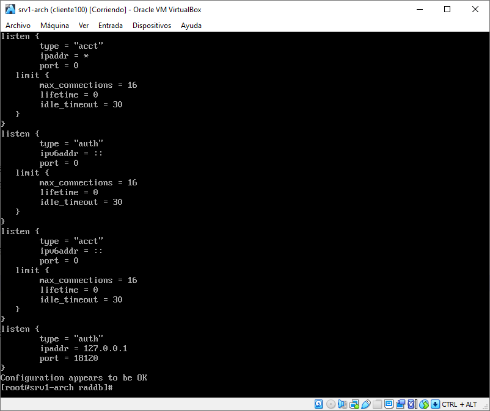

### Inicio de radiusd en modo debug
Ahora iniciaremos el radius en modo debug. Tras esto iremos a pfSense a configurarlo, pero primero, veremos qué salida nos arroja el mismo. La ejecución se realiza mediante el comando
```bash
sudo -u radiusd radiusd -X
```
Esto nos arrojará la siguiente salida si todo ha ido bien:

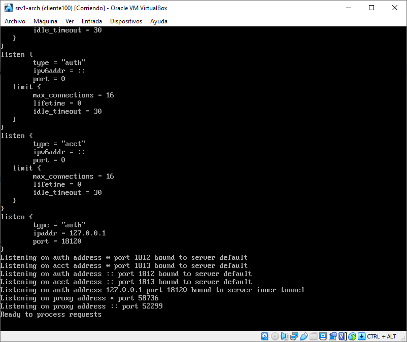

## Configuración de freeradius en pfSense
Ahora debemos configurar la autenticación de nuestro portal cautivo desde pfSense desde la web UI de la siguiente manera:
- System
  - User Manager
    - Authentication Servers
      - Add
        - Server Settings
          - Descritptive name *Servidor FreeRADIUS en srv1-arch*
          - Type *RADIUS*
        - RADIUS Server Settings
          - Protocol *PAP*
          - Hostname or IP address *192.168.1.200*
          - Shared Secret *pc1234*
          - Services Offered *Authentication*
          - Authentication Timeout *5* (el valor por defecto)
          - RADIUS NAS IP Attribute *OPT1 - 192.168.2.1*
      - 💾 *Save*

### Comprobación de configuración correcta
Para comprobar que la conexión al servidor RADIUS sea correcta, podemos dirigirnos a
- Diagnostics
  - Authentication
    - Authentication Test
      - Authentication Server *Servidor FreeRADIUS en srv1-arch*
      - Username *cliente1*
      - Password *cliente1*

Si todo ha salido correctamente, deberemos ver el correspondiente log en *srv1-arch*, y un mensaje indicando que la autenticación ha tenido éxito en la web UI de pfSense, como se muestra en la imagen a continuación.

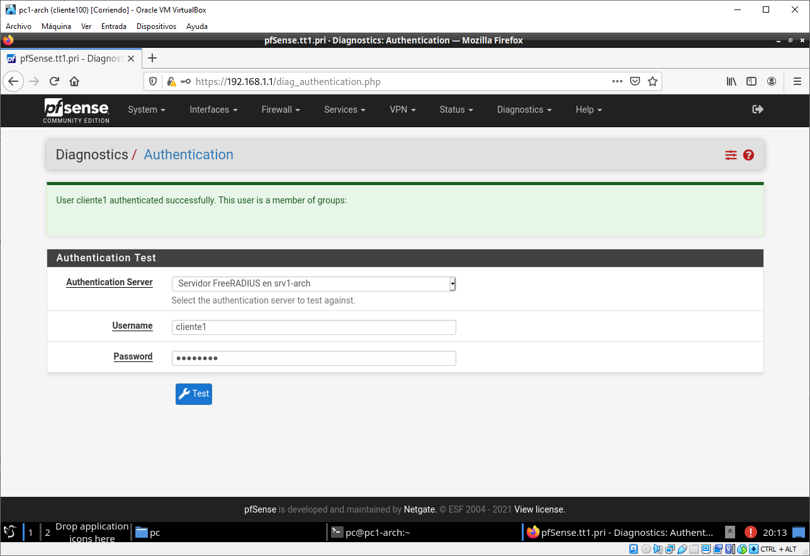

## Configuración del Portal Cautivo para que autentique contra el servidor RADIUS
Ahora hemos de modificar como ya hicimos antes la autenticación del portal cautivo, para que lo haga contra el servidor FreeRADIUS, tal que
- Services
  - Captive Portal
    - Clientes -> Edit (✏️)
      - Authentication
        - Authentication Server
          - *Servidor FreeRADIUS en srv1-arch*
        - Secondary authentication Server
          - *lo dejamos vacío*
    - 💾 *Save*


<div style="page-break-after: always;"></div>

# Configuración de LDAPS (LDAP over TLS)
## Instalación de Easy-RSA
Como parece que no hay forma de usar OpenSSL sin que falle algo, vamos a recurrir a Easy-RSA, porque mientras escribo esto llevamos cuatro intentos diferentes solo para crear las claves y que verifiquen.

Instalamos Easy-RSA con:
```bash
pacman -S easy-rsa
```

## Creación de CA y certificados
### Creación de CA
Procedemos tal que
```bash
cp -R /etc/easy-rsa /home/pc/pki-ldap
cd /home/pc/pki-ldap
export EASYRSA=$(pwd)
easyrsa init-pki
easyrsa build-ca
```
- Enter New CA Key Passphrase `pc1234`
- Common Name *srv1-arch.tt1.pri*

Esto nos ubicará `ca.crt` en `/home/pc/pki-ldap/pki/ca.crt` y `ca.key` en `/home/pc/pki-ldap/pki/private/ca.key`.

### Creación de certificados para clientes
Creamos la solicitud de certificado para slapd:
```bash
cd /home/pc/pki-ldap
easyrsa gen-req slapd nopass
```
- Common Name *srv1-arch.tt1.pri*

Esto nos ubicará `slapd.req` en `/home/pc/pki-ldap/pki/reqs/slapd.req` y `slapd.key` en `/home/pc/pki-ldap/pki/private/slapd.key`.


Ahora firmamos la request:
```bash
easyrsa sign-req client slapd
```

- Respondemos *yes*
- Ponemos la passphrase `pc1234`

Esto nos ubicará `slapd.crt` en `/home/pc/pki-ldap/pki/issued/slapd.crt`

## Configuración de slapd
### Copia de los certificados a /etc/openldap
Copiaremos los certificados previamente creados con:

```bash
cp /home/pc/pki-ldap/pki/private/slapd.key /etc/openldap/
cp /home/pc/pki-ldap/pki/issued/slapd.crt /etc/openldap/
cp /home/pc/pki-ldap/pki/ca.crt /etc/openldap/
```

Y les cambiamos el propietario
```bash
chmod 440 /etc/openldap/{slapd.key,slapd.crt}
chmod 444 /etc/openldap/ca.crt
chown ldap:ldap /etc/openldap/{slapd.key,slapd.crt,ca.crt}
```

### Configuración de slapd.conf
Ahora añadiremos las rutas de los certificados a `/etc/openldap/slapd.conf` con:
```bash
cat << EOS >> /etc/openldap/slapd.conf

#######################################################################
# TLS configuration 
#######################################################################

TLSCipherSuite DEFAULT
TLSCipherSuite HIGH:MEDIUM:-SSLv2:-SSLv3
TLSCACertificateFile    /etc/openldap/ca.crt
TLSCertificateFile      /etc/openldap/slapd.crt
TLSCertificateKeyFile   /etc/openldap/slapd.key
EOS
```

### Aplicación de las configuraciones
Para aplicar las configuraciones realizamos
```bash
systemctl stop slapd
rm -rf /etc/openldap/slapd.d/*
sudo -u ldap slaptest -f /etc/openldap/slapd.conf -F /etc/openldap/slapd.d/
```

### Modificación de la unit de systemd
Editamos la unit de systemd con `systemctl edit slapd.service` y ponemos en la zona editable:
```bash
[Service]
ExecStart=
ExecStart=/usr/bin/slapd -u ldap -g ldap -h "ldaps:///"
```
como se muestra en la imagen a continuación:

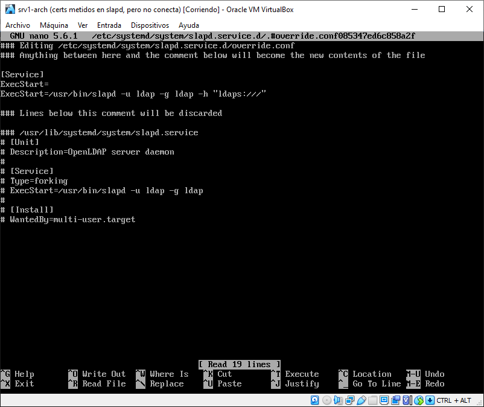

Finalmente ejecutaremos
```bash
systemctl restart slapd
systemctl disable slapd
systemctl enable slapd
```

### Configuración de ldap.conf (cliente)
Debemos añadir un par de líneas en `/etc/openldap/ldap.conf` para que admita el certificado:

```bash
cat << EOS >> /etc/openldap/ldap.conf

#######################################################################
# TLS configuration 
#######################################################################

TLS_CACERT  /etc/openldap/ca.crt
TLS_REQCERT allow
EOS
```

además, también deberemos modificar la línea `URI`, comentando la que estaba previamente, y agregando debajo una nueva que sea:

```bash
URI     ldaps://192.168.1.200:636
```

### Testeo de la configuración
Para testear la configuración es tan sencillo como hacer un:
```bash
ldapsearch -x -b "dc=tt1,dc=pri"
```
y ver que obtenemos respuesta.

## Configuración en pfSense
Una vez hemos configurado LDAPS, el servidor de autenticación por LDAP en pfSense que configuramos previamente ya no funciona, así que simplemente lo eliminaremos tal que:
- System
  - User Manager
    - Authentication Servers
      - Servidor OpenLDAP en srv1-arch -> Delete (🗑️)

<div style="page-break-after: always;"></div>

# Configuración de RADIUS a LDAPS
Ahora nuestro servicio de autenticación por RADIUS ya no funciona, ya que no es capaz de conectar al servidor LDAP (sólo admite LDAPS). Para solucionarlo hay que configurar LDAPS en radius.

## Cambio de configuración en srv1-arch
Para esto vamos a `/etc/raddb/mods-available/ldap`:
- Verificamos que el campo `server` = `ldaps://localhost`
- En la sección `tls` (buscando por `tls {`):
  - Descomentamos y modificamos el campo `ca_file` = `/etc/openldap/ca.crt`
  - Justo encima del campo anterior, descomentamos y modificamos el campo `start_tls` = `no`

Ahora, como se comenta en la sección de [configuración de la configuración de RADIUS en pfSense](###Comprobación-de-configuración-correcta), ejecutamos radius con `sudo -u radiusd radiusd -X` y podemos comprobar que funciona desde la interfaz en pfSense.

## Activación del servicio
Si todo ha salido bien y está funcionando, podemos parar el comando que ejecutamos en modo debug, y proceder a activar el servicio en srv1-arch con el comando
```bash
systemctl enable --now freeradius
```

<div style="page-break-after: always;"></div>

# Separación de freeradius en srv2-arch
## Importación y configuración inicial de srv2-arch
Hasta el momento, srv1-arch es servidor de tanto LDAP como de FreeRADIUS. Sin embargo, esto no va a ser necesariamente siempre así. Es un escenario posible que el servidor RADIUS y el OpenLDAP sean computadores, o recursos virtualizados separados, y por tanto, tambien un poco por practicar, vamos a hacer eso mismo: Separar FreeRADIUS de srv1-arch, a un nuevo ordenador srv2-arch.

Para ello realizaremos lo siguiente:

Importaremos la imagen creada previamente pcBase-arch, como se especifica en [Importar srv1-arch](##Importar-srv1-arch), y lo nombraremos `srv2-arch`.

Tras el inicio, ejecutaremos los siguientes comandos para dejar la configuración completa
```bash
sudo sed -i 's/pc1-arch/srv2-arch/g' /etc/hostname
sudo sed -i 's/pc1-arch/srv2-arch/g' /etc/hosts
sudo rm /etc/machine-id
sudo reboot
```

## Asignación de IP estática
Para continuar, y si bien no es necesario asignarle IP estática, ya que el DNS forwarder ya relaciona las IP en DHCP con el hostname, vamos a asignarle la IP `192.168.1.201`. Para ello procedemos tal como se indica en [Binding DHCP estático](###Binding-DHCP-estático). Obviamente deberemos cambiar la IP y la MAC. (en mi caso *08:00:27:DF:6B:75*)

## Instalación de FreeRADIUS
Procederemos como en [Autenticación con FreeRADIUS](#Autenticación-mediante-freeradius), es decir:

Instalamos
```bash
sudo pacman -S freeradius
```

Hecho esto, realizamos el resto de pasos con un par de diferencias:
En `/etc/raddb/mods-available/ldap`, donde antes poníamos `server` = `localhost`, ahora pondremos `server` = `192.168.1.200`, y en el campo `ca_file`, como ahora no existe la carpeta /etc/openldap, pondremos `/etc/raddb/ca.crt`.

Un detalle importante tambien es tener `require_cert` = `'allow'`

Posterioremente aplicamos las modificaciones pertinentes, tal como se indica en [Configuración de RADIUS a LDAPS](#-Configuración-de-RADIUS-a-LDAPS). Un detalle importante es que debemos pasar el CA-Cert al nuevo servidor, esto se puede hacer mediante openssh. Para ello, hemos de instalarlo y ejecutarlo.
```bash
sudo pacman -S openssh
sudo systemctl start sshd
```
En mi caso haré el trasvase desde la interfaz gráfica de pc1-arch, por lo que instalaré openssh en pc1-arch, y lo instalaré + ejecutaré el daemon en srv1-arch y srv2-arch.

## Desactivación y parada del servicio freeradius en srv1-arch
Lo paramos con:
```bash
sudo systemctl disable --now freeradius
```

## Modificación de freeradius en pfSense
Tras haber realizado todos los pasos previos, ahora configuraremos pfSense para que autentique contra el nuevo servidor FreeRADIUS. Además como posteriormente vamos a añadir servicios de accounting, tambien lo activamos. Esto se realiza en:
- Services
  - Captive Portal
    - Clientes -> Edit (✏️)
      - Authentication
        - RADIUS Server Settings
          - Hostname or IP address *192.168.1.201*
          - Services offered *Authentication and Accounting*
    - 💾 *Save*

Aquí podremos notar que el nombre sigue terminando en srv1-arch, a pesar de que ahora lo estamos alojando en otro servidor. Nos gustaría poder cambiarlo, pero desafortunadamente no se puede, así que dejamos el nombre.

<div style="page-break-after: always;"></div>

# Activación de freeradius para accounting
## Configuraciones en srv1-arch
### Configuración del servidor
Para obtener los ficheros de schema, debemos tener instalado freeradius en el ordenador que hostea LDAP. Como en srv1-arch ya hemos usado previamente freeradius, ya tenemos los archivos en su sitio, y no tenemos que instalar nada. Copiamos los archivos con:
```bash
cp /usr/share/doc/freeradius/schemas/ldap/openldap/freeradius.schema /etc/openldap/schema/
cp /usr/share/doc/freeradius/schemas/ldap/openldap/freeradius.ldif /etc/openldap/schema/
```

Y editamos el fichero `/etc/openldap/slapd.conf` y añadimos al final de la "sección" de includes la línea:
```bash
include         /etc/openldap/schema/freeradius.schema
```

Tras esto regeneramos la configuración como ya hemos hecho previamente con:
```bash
rm -rf /etc/openldap/slapd.d/*
sudo -u ldap slaptest -f /etc/openldap/slapd.conf -F /etc/openldap/slapd.d/
```

Y reiniciamos el servicio con:
```bash
sudo systemctl restart slapd
```

### Modificación del directorio
Ahora deberemos añadirles a los clientes del 1 al 100 la clase `radiusprofile` y ponerles un `radiusIdleTimeout` = 60. Para esto creamos el siguiente script llamado `genmodusers.sh`:

```bash
#!/bin/bash

echo -n > modradusers.ldif

for i in {1..100}; do
  echo dn: cn=Cliente $i,ou=users,dc=tt1,dc=pri >> modradusers.ldif
  echo changetype: modify >> modradusers.ldif
  echo add: objectClass >> modradusers.ldif
  echo objectClass: radiusprofile >> modradusers.ldif
  echo "" >> modradusers.ldif
done  

for i in {1..100}; do
  echo dn: cn=Cliente $i,ou=users,dc=tt1,dc=pri >> modradusers.ldif
  echo changetype: modify >> modradusers.ldif
  echo replace: radiusIdleTimeout >> modradusers.ldif
  echo radiusIdleTimeout: 60 >> modradusers.ldif
  echo "" >> modradusers.ldif
done  
```

Y tras ejecutarlo con `bash genmodusers.sh`, conseguiremos el archivo `modradusers.ldif`, el cual deberemos enviar al servidor LDAP con
```bash
ldapmodify -x -D 'cn=root,dc=tt1,dc=pri' -W -f modradusers.ldif
```

## Configuraciones en srv2-arch
Ahora hemos de realizar las modificaciones más importantes en la parte de FreeRADIUS:

En `/etc/raddb/sites-enabled/default`:
- Buscamos (primera coincidencia) `accounting {`:
  - Añadimos en esa sección una línea que diga `ldap`.
- Buscamos (primera coincidencia) `post-auth {`:
  - Buscamos y descomentamos la línea que dice `ldap`.

En `/etc/raddb/mods-available/ldap`:
- Buscamos (primera coincidencia) `update {`:
  - Añadimos en la sección de mapeo la línea
    ```bash
    reply:Idle-Timeout              := 'radiusIdleTimeout'
    ```

Y reiniciamos el servicio con
```bash
sudo systemctl restart freeradius
```

## Configuraciones en pfSense
Ahora hemos de activar el accounting para el portal cautivo en pfSense, para esto desde la web UI:
- Services
  - Captive Portal
    - Clientes -> Edit (✏️)
      - Captive Portal Configuration
        - Idle timeout (Minutes) *\*en blanco\**
        - Hard timeout (Minutes) *240* (lo seguimos dejando en 240)
      - Authentication
        - Session timeout [x] *Use RADIUS Session-Timeout attributes*
      - Accounting
        - RADIUS [x] *Send RADIUS accounting packets*
        - Accounting Server *Servidor FreeRADIUS en srv1-arch*
        - Send accounting updates *Interim*
        - Idle time accounting [x] *Include idle time when users get disconnected due to idle timeout*
    - 💾 *Save*

<div style="page-break-after: always;"></div>

# Comprobación Final
Ahora como podemos comprobar, FreeRADIUS hace accounting al servidor OpenLDAP, dejando una descripción en el campo `description`.

Cliente previamente desconectado por Idle-Timeout:
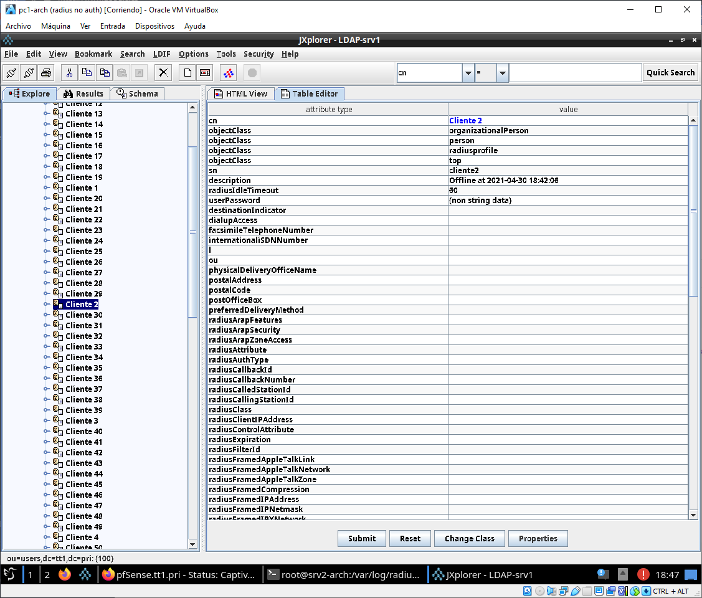

Cliente actualmente conectado:
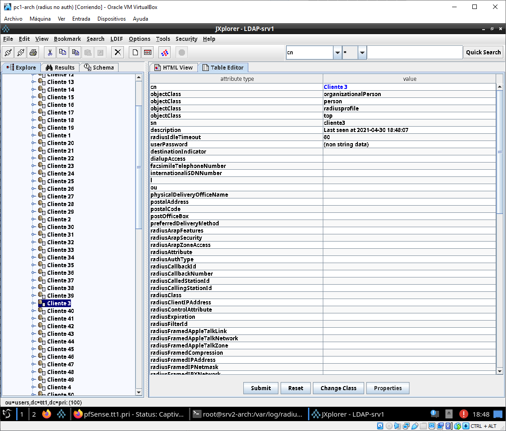

<div style="page-break-after: always;"></div>

# Conclusiones
El resultado ha sido positivo, consideramos que, si bien se han producido multitud de dificultades a la hora de completar todos los apartados que propusimos, estas han aportado mayor profundidad a nuestro conocimiento de la materia.

Incluso hemos logrado desarrollar cierto pensamiento intuitivo, el cual, no es usual trabajando con herramientas tan específicas.

Trabajar con Arch parece haber sido un acierto, no solo por su fantástico y ya conocido soporte en la Arch Wiki, sido debido a que en general, su elección ha simplificado mucho las cosas.

Esta simpleza y minimalismo, así como el esquema rolling release de ARch Linux nos permite que tengamos soporte nativo de OpenSSL en OpenLDAP debido a estar en la última versión sin tener que recompilar (y de tener que haberlo hecho, hubiese sido mucho más sencillo que en Debian, gracias a la facilidad de edición de los PKGBUILD, y en general al sistema de compilación de Arch Linux, que es muy flexible).

<div style="page-break-after: always;"></div>

# Bibliografía
[25/04/2021] https://docs.netgate.com/pfsense/en/latest/

[25/04/2021] https://forum.netgate.com/topic/130826/no-internet-on-opt1 

[25/04/2021] https://wiki.archlinux.org/index.php/OpenLDAP 

[25/04/2021] https://wiki.archlinux.org/index.php/LDAP_authentication 

[25/04/2021] https://ldapwiki.com/wiki/ 

[25/04/2021] https://wiki.archlinux.org/index.php/LXQt 

[25/04/2021] 
https://wiki.archlinux.org/index.php/VirtualBox/Install_Arch_Linux_as_a_guest#Install_the_Guest_Additions 

[25/04/2021] https://www.bellera.cat/josep/pfsense/dns_cs.html 

[25/04/2021] https://wiki.archlinux.org/index.php/Systemd-networkd 

[27/04/2021] https://wiki.freeradius.org/config/Configuration%20files 

[27/04/2021] https://techexpert.tips/es/pfsense-es/pfsense-autenticacion-de-radio-mediante-freeradius/ 

[27/04/2021] https://www.howtoforge.com/wikid-openldap-freeradius-howto 

[27/04/2021] http://lists.freeradius.org/pipermail/freeradius-users/2017-September/088734.html 

[28/04/2021] https://www.nasirhafeez.com/freeradius-with-ldaps-on-azure-ad-domain-services/ 

[28/04/2021] https://www.linuxito.com/gnu-linux/nivel-alto/994-como-implementar-ldap-sobre-ssl-tls-con-openldap 

[30/04/2021] 
https://wiki.zimbra.com/wiki/Automation:_how_to_change_LDAP_attribute_for_all_users 

[30/04/2021] https://serverfault.com/questions/224687/how-to-modify-add-a-new-objectclass-to-an-entry-in-openldap 

[30/04/2021] 
https://www.oreilly.com/library/view/radius/0596003226/re24.html#:~:text=An%20administrator%20may%20configure%20the,may%20remain%20active%20yet%20idle. 