# TT - AII 2021

# pfSense
## Instalación de pfSense 2.5.1
### Configuración de la máquina virtual
Para este trabajo utilizaremos el hipervisor gratuito VirtualBox, en concreto en su última versión a fecha de escritura: `6.1.20`, con la misma revisión del Oracle VM Extension Pack.

Comenzaremos con la creación de la máquina virtual e instalación en la misma de pfSense. Para ello:

- Máquina -> Nueva *(CTRL+N)*
- Modo experto
  - Nombre *pfSense*
  - Carpeta de máquina *preferiblemente en un SSD*
  - Tipo *BSD*
  - Versión *FreeBSD (64-bit)*
  - Tamaño de  memoria *1024MB*
  - Disco duro *Crear un disco duro virtual ahora*
  - *Crear*
- Crear disco duro virtual
  - Tamaño de archivo *30GB*
  - Tipo de archivo de disco duro *VMDK*
  - Almacenamiento *Reservado dinámicamente*
  - *Crear*
- Máquina -> Configuración *(CTRL+S)*
  - General
    - Avanzado
      - Compartir portapapeles *Bidireccional*
      - Arrastrar y soltar *Bidireccional*
  - Sistema
    - Procesador
      - Procesador(es) *1* <-- Este punto es importante, ya que por alguna razón, si se le ponen más de un núcleo en virtualbox, la latencia de la primera conexión sube mucho. Es un error curioso, pero con un núcleo los tiempos pasan a ser tolerables.
  - Almacenamiento
    - *Seleccionamos el disco óptico*
    - Cargamos la ISO `pfSense-CE-2.5.1-RELEASE-amd64.iso`
  - Red
    - Adaptador 1
      - Habilitar adaptador de red *[x]*
      - Conectado a *Adaptador Puente*
      - Avanzadas
        - Tipo de adaptador *Intel PRO/1000 MT Desktop (82540EM)*
    - Adaptador 2
      - Habilitar adaptador de red *[x]*
      - Conectado a *Red interna*
      - Nombre de red *intnet*
      - Avanzadas
        - Tipo de adaptador *Intel PRO/1000 MT Desktop (82540EM)*
    - Adaptador 3
      - Habilitar adaptador de red *[x]*
      - Conectado a *Red interna*
      - Nombre de red *captivenet*
      - Avanzadas
        - Tipo de adaptador *Intel PRO/1000 MT Desktop (82540EM)*
  - *Aceptar*

### Instalación de pfSense
Iniciamos la máquina y en seleccionar disco de inicio seleccionamos la ISO de pfSense que cargamos anteriormente.

En los diálogos siguientes actuamos tal que:
- **A**ccept
- **I**nstall -> **O**K
- Seleccionamos el keymap que se adecúe al nuestro, en mi caso es US, así que podemos darle a *>>> Continue with default keymap* -> **S**elect
- **A**uto (UFS) BIOS -> **O**K

Esperamos pacientemente a que se instale (no debería tardar mucho)...
Cuando haya terminado nos preguntará si queremos abrir un shell para realizar otras modificaciones al sistema, a lo que respondemos:
- **N**o
- **R**eboot

Antes de que se inicie el sistema de nuevo, deberemos ir *rápidamente* en el menú de VirtualBox a Dispositivos -> Unidades ópticas -> Eliminar disco de la unidad virtual. Si no da tiempo, no hay mayores problemas, simplemente esperamos a que arranque, quitamos el DVD, y reiniciamos la máquina en Máquina -> Reiniciar.

### Primer arranque de pfSense
Al arrancar podremos ver una terminal de texto plano desde la que realizar tareas básicas. Esto es así ya que muchas de las tareas más complejas se realizarán desde la GUI web.

Como podemos observar, tenemos dos interfaces, `WAN` y `LAN`. La primera es el adaptador a NAT de VirtualBox, y la segunda será la que usaremos como la boca a nuestra red interna. Los nombres em0 y em1 indican que son tarjetas de red que funcionan con el driver intel. Además, nos interesa tener una tercera interfaz, por la que crearemos el portal cautivo, llamada `OPT1`. Para esto, tendremos que configurar las interfaces:
- **1**
- **n**
- *em0*
- *em1*
- *em2*
- **y**

De esta forma, las interfaces quedarán configuradas de forma estática tal que
- WAN  -> em0 
- LAN  -> em1

y veremos la siguiente salida:

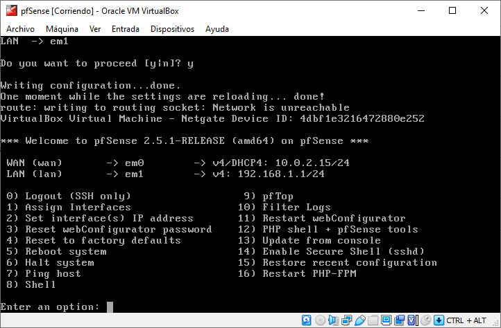

# Clientes ArchLinux
Para configurar pfSense necesitaremos acceder desde LAN al servidor, por lo que debemos crear varias máquinas cliente. La distribución elegida es ArchLinux, la cual también usaremos para alojar el servidor LDAP.

## Instalación de pc1-arch
### Configuración de la máquina virtual
- Máquina -> Nueva *(CTRL+N)*
- Modo experto
  - Nombre *pc1-arch*
  - Carpeta de máquina *preferiblemente en un SSD*
  - Tipo *Linux*
  - Versión *Arch Linux (64-bit)*
  - Tamaño de  memoria *2048MB*
  - Disco duro *Crear un disco duro virtual ahora*
  - *Crear*
- Crear disco duro virtual
  - Tamaño de archivo *30GB*
  - Tipo de archivo de disco duro *VMDK*
  - Almacenamiento *Reservado dinámicamente*
  - *Crear*
- Máquina -> Configuración *(CTRL+S)*
  - General
    - Avanzado
      - Compartir portapapeles *Bidireccional*
      - Arrastrar y soltar *Bidireccional*
  - Sistema
    - Procesador
      - Procesador(es) *2*
  - Almacenamiento
    - *Seleccionamos el disco óptico*
    - Cargamos la ISO `archlinux-2021.04.01-x86_64.iso`
  - Red
    - Adaptador 1
      - Habilitar adaptador de red *[x]*
      - Conectado a *Red interna*
      - Nombre de red *intnet*
      - Avanzadas
        - Tipo de adaptador *Intel PRO/1000 MT Desktop (82540EM)*
  - *Aceptar*

### Instalación de ArchLinux
Iniciamos la máquina y en seleccionar disco de inicio seleccionamos la ISO de ArchLinux que cargamos anteriormente.

En el menú Syslinux seleccionamos la primera opción
- Arch Linux install medium (x86_64, BIOS)

Mediante el script de AutoHotKey autotecleamos el siguiente script en Arch para realizar la instalación. Por ejemplo le llamaremos `install`:
```bash
#!/bin/bash

# exit on failure
set -e

timedatectl set-ntp true

# Escribimos el script
cat << EOS > partition.sfdisk
label: dos
label-id: 0x27e2bcd8
device: /dev/sda
unit: sectors
sector-size: 512

/dev/sda1 : start=2048, size=62912512, type=83, bootable
EOS

# Lo ejecutamos para particionar el disco
sfdisk /dev/sda < partition.sfdisk

# Creamos el sistema de ficheros
mkfs.ext4 -F /dev/sda1

mount /dev/sda1 /mnt

# Instalamos el sistema
pacstrap /mnt linux linux-firmware base base-devel nano grub bmon htop

genfstab -U /mnt >> /mnt/etc/fstab

echo "LANG=en_US.UTF-8" > /mnt/etc/locale.conf
echo "KEYMAP=en_US.UTF-8" > /mnt/etc/vconsole.conf
echo "pc1-arch" > /mnt/etc/hostname

cat << EOS >> /mnt/etc/hosts

127.0.0.1 localhost
::1       localhost
127.0.1.1	pc1-arch.tt1.pri pc1-arch
EOS

cat << EOS >> /mnt/etc/systemd/network/20-wired.network
[Match]
Name=enp0s3

[Network]
DHCP=ipv4
EOS

cat << EOS > /mnt/chroot-steps.sh
#!/bin/bash

set -e

ln -sf /usr/share/zoneinfo/Europe/Madrid /etc/localtime
hwclock --systohc

sed -i '/#en_US.UTF-8 UTF-8/s/^#//g' /etc/locale.gen
locale-gen
grub-install --target=i386-pc /dev/sda
grub-mkconfig -o /boot/grub/grub.cfg

useradd -m pc
echo 'root:pc' | chpasswd
echo 'pc:pc' | chpasswd

sed -i '/# %wheel ALL=(ALL) NOPASSWD: ALL/s/^# //g' /etc/sudoers

# Hacemos a pc sudoer
usermod -aG wheel,audio,video,optical,storage pc

# Activamos la red
systemctl enable systemd-networkd systemd-resolved
EOS

chmod +x /mnt/chroot-steps.sh

arch-chroot /mnt /chroot-steps.sh

poweroff
```

y lo ejecutamos con `bash install`

No nos hemos dado cuenta, pero realizando esta instalación ya hemos probado que el pfsense funciona, ya que Arch Linux solo se instala desde red, y la máquina que da red a la red interna es, efectivamente, la de pfSense.

Esto lo podemos probar de varias maneras, como haciendo ping a `gnu.org`, mirando la IP, puerta de enlace, etc, como se muestra en la siguiente imagen:

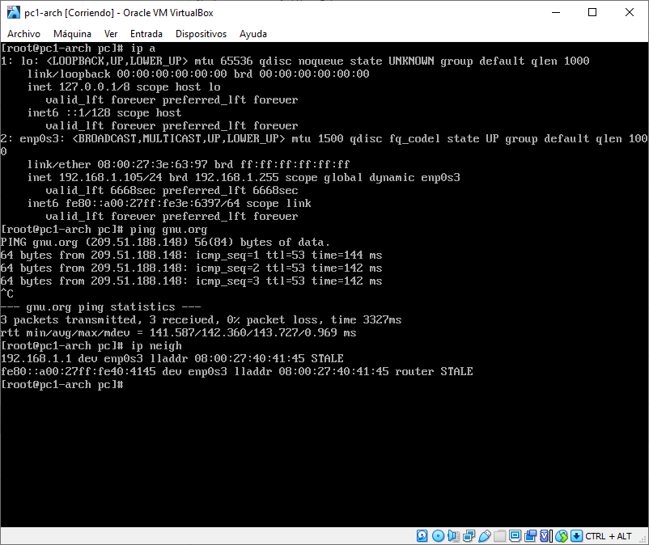

### Exportar pcBase-arch
Seleccionamos la máquina `pc1-arch` y procedemos tal que:
- Archivo
  - Exportar servicio virtualizado *(CTRL+E)*
    - Formato *Open Virtualization Format 2.0*
    - Política de direcciones MAC *Quitar todas las direcciones MAC*
    - Nombre *pcBase-arch*
  - *Exportar*

Recordemos que a pesar de ser este el sistema base, lo creamos a partir de pc1, y por tanto hemos de editar `/etc/hostname` y `/etc/hosts` para otras copias del mismo. 

## Importar srv1-arch
Ahora vamos a importar el servidor, donde hostearemos el servidor LDAP. Para ello:
- Archivo
  - Importar servicio virtualizado *(CTRL+I)*
    - Modo experto
    - Fuente: *seleccionamos la .ova que hemos guardado previamente*
    - Carpeta base de la máquina *como prefiramos, pero de nuevo, recomendable SSD*
    - Política de dirección MAC *Generar nuevas direcciones MAC*
    - Importar discos como VDI *[  ]*
    - *Importar*
- Seleccionamos el nuevo servicio importado, y le cambiamos el nombre de *pcBase-arch* a *srv1-arch*

Iniciamos *srv1-arch*, e iniciamos sesión con `pc:pc`. Tras eso editamos los archivos relacionados con el hostname con
```bash
sudo sed -i 's/pc1-arch/srv1-arch/g' /etc/hostname
sudo sed -i 's/pc1-arch/srv1-arch/g' /etc/hosts
sudo rm /etc/machine-id
```

Es importante la última línea, ya que si nuestra machine-id coincide, vamos a tener todo tipo de conflictos, por ejemplo con la IP en los DHCP. Tras eso reiniciamos (por ejemplo con `sudo reboot`).

## Instalar un entorno de escritorio en pc1-arch
Para evitarnos problemas, ya que se ha detectado que los primeros mirrors de la ISO a momento de realización del trabajo no están funcionando correctamente, se propone actualizar la mirrorlist con:
```bash
sudo pacman -S reflector
sudo reflector --verbose --latest 5 --protocol https --sort rate \
--save /etc/pacman.d/mirrorlist
sudo pacman -Syy
```

Para instalar un entorno de escritorio en Arch Linux es realmente sencillo, únicamente debemos tener acceso a internet y ejecutar el siguiente comando, pulsando \<ENTER\> ante cualquier diálogo (acepta por defecto).
```bash
sudo pacman -S lxqt papirus-icon-theme sddm virtualbox-guest-utils \
noto-fonts firefox
sudo systemctl enable vboxservice.service sddm
sudo reboot
```

En Arch Linux hay que configurar las cosas manualmente, así que tenemos que habilitar el pack de iconos que hemos instalado. Para eso vamos al menú de inicio y:
- Preferences
  - LXQt Settings
    - Appearance
      - Icons Theme: *Papirus-Dark*

Tras esto reiniciamos, o cerramos sesión y volvemos a iniciarla para reiniciar X.

## Configuración mediante la WebUI de pfSense desde pc1-arch
Ahora vamos al Menú de Inicio -> Internet -> Firefox, lo abrimos, y nos dirigimos a la dirección 192.168.1.1, lo cual nos mostrará una pantalla como la siguiente:

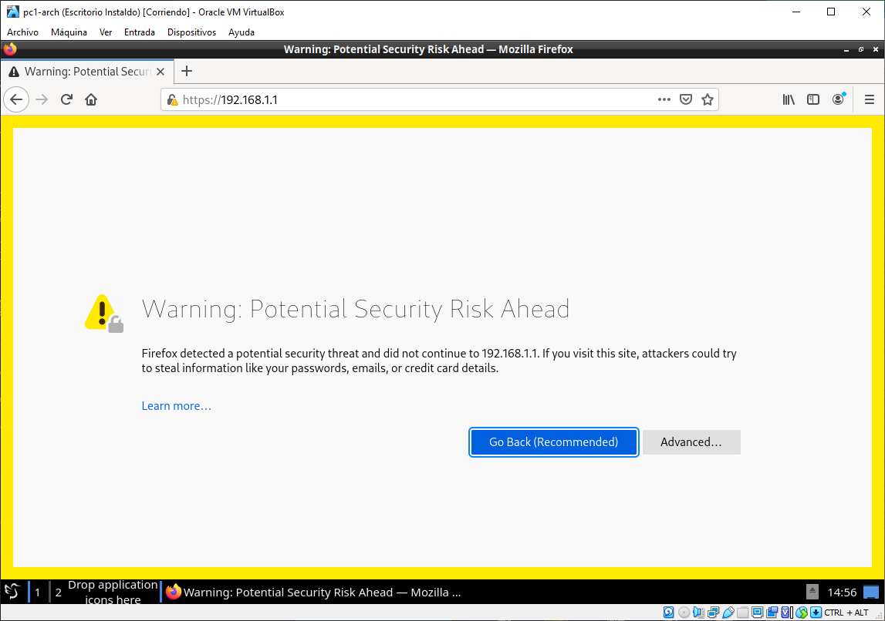

Esto es producido porque pfSense está utilizando un certificado autofirmado, pero no hay mayor problema en usarlo así. Para continuar haremos click en *Advanced* -> *Accept the Risk and Continue*. Tras continuar veremos la webUI de pfSense, introduciremos las credenciales `admin:pfsense`:

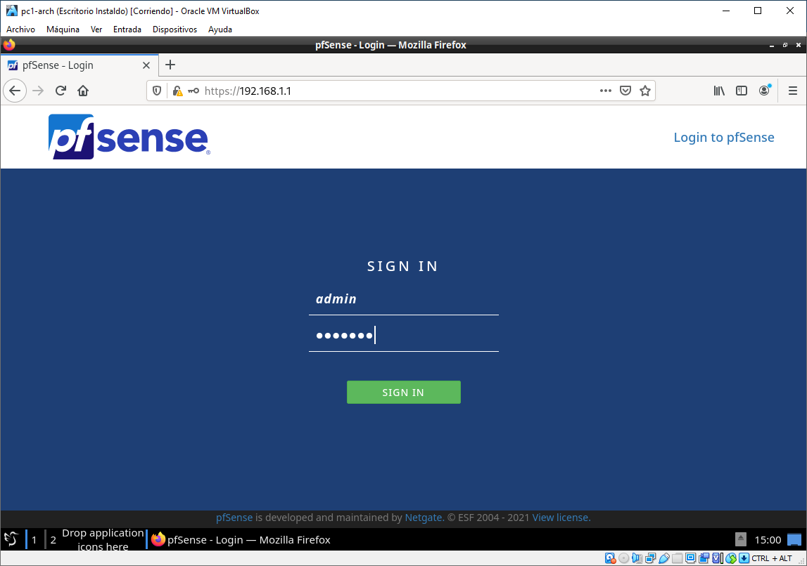

Como podemos imaginar, esto de que la contraseña sea la que viene por defecto, no es precisamente una buena práctica de seguridad, por lo que nos tocará cambiarla. Aprovechando el Warning que nos sale, haremos click en *Change the password in the User Manager*, como se muestra en la imagen siguiente:

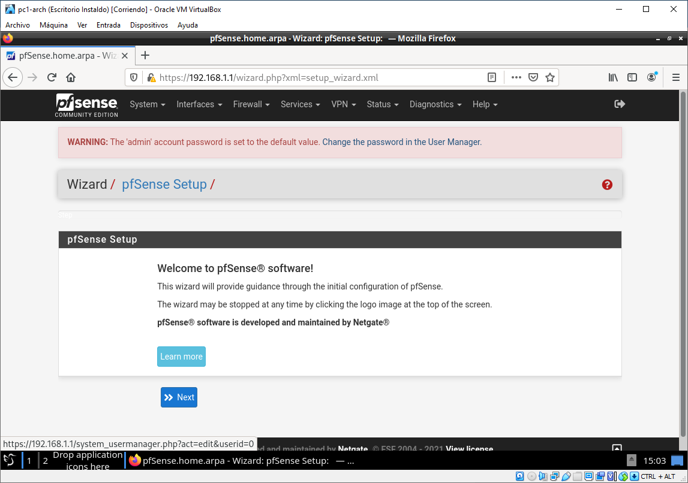

La nueva contraseña a efectos de demostración, y que evidentemente no debe ser usada en produccion por su sencilleza será `pc1234`. Tras esto bajamos al final de la página y hacemos click en 💾 *Save*.

Una vez guardado iremos a la parte superior derecha de la página para hacer *logout* y volveremos a iniciar sesión con las nuevas credencias `admin:pc1234`. Esto nos debería dejar en la siguiente pantalla: el Dashboard.

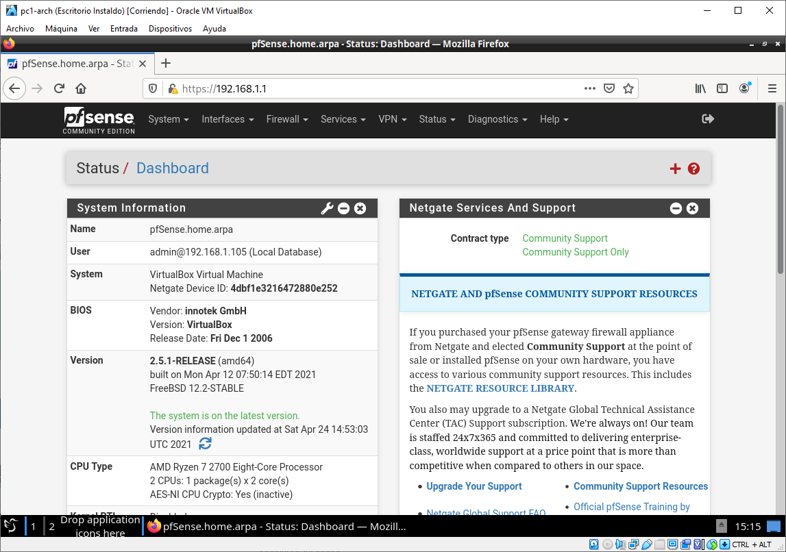

Ahora vamos a configurar la red con portal cautivo en la interfaz `OPT1`. Para ello nos dirigiremos en el menú web de pfSense a:
- Interfaces
  - OPT1
    - General Configuration
      - Enable [x] *Enable Interface*
      - IPv4 Configuration Type *Static IPv4*
      - IPv6 Configuration Type *None*
    - Static IPv4 Configuration
      - IPv4 Address *192.168.2.1* / *24*
  - 💾 *Save*

Configuramos el servidor DHCP
- Services
  - DHCP Server
    - *OPT1*
      - General Options
        - Enable [x] *Enable DHCP server on OPT1 interface*
        - Range
          - From *192.168.2.100*
          - To *192.168.2.199*
  - 💾 *Save*

Y las reglas del Firewall, las cuales tenemos que copiar de la interfaz LAN, como se ve en la imagen a continuación:

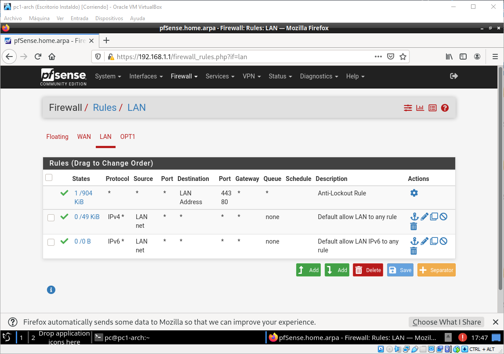

- Firewall
  - Rules
    - OPT1
      - Add
        - Edit Firewall Rule
          - Protocol *Any*
        - Source
          - Source *OPT1 net*
      - 💾 *Save*
      - Add
        - Edit Firewall Rule
          - Address Family *IPv6*
          - Protocol *Any*
        - Source
          - Source *OPT1 net*
      - 💾 *Save*
  - *Apply Changes*


Con esto ya estaría configurado el acceso a internet sin restricciones en la interfaz secundaria, donde configuraremos el portal cautivo. Tras ello crearemos un par de máquinas virtuales para testear la conexión por `OPT1`, y que posteriormente pasarán por el portal cautivo.

### Otras configuraciones
Además, un par de configuraciones que teníamos pendientes son las siguientes:
- System
  - General Setup
    - System
      - Domain *tt1.pri*
    - DNS Server Settings
      - DNS Servers *8.8.8.8*
      - DNS Servers *1.0.0.1*
      - DNS Server Override [ ] *Allow DNS server list to be overridden by DHCP/PPP on WAN*
    - Localization
      - Timezone *Europe/Madrid*
  - 💾 *Save*

- DNS Forwarder
  - General DNS Forwarder options
    - Enable [x] *Enable DNS forwarder*
    - DHCP Registration [x] *Register DHCP leases in DNS forwarder*
    - Static DHCP [x] *Register DHCP static mappings in DNS forwarder*
    - Interfaces *Seleccionamos LAN y OPT1 con CTRL*

# Clientes del Portal Cautivo
Para crear los clientes importaremos dos veces pcBase-arch, como se especifica en [Importar srv1-arch](##Importar-srv1-arch).

Los nombraremos `cliente1-arch` y `cliente2-arch`, les cambiaremos la red interna a `captivenet`, e [instalaremos el entorno de escritorio](##Instalar-un-entorno-de-escritorio-en-pc1-arch)

Copypaste para cliente1
```bash
sudo sed -i 's/pc1-arch/cliente1-arch/g' /etc/hostname
sudo sed -i 's/pc1-arch/cliente1-arch/g' /etc/hosts
sudo rm /etc/machine-id
sudo reboot
```

y para cliente2
```bash
sudo sed -i 's/pc1-arch/cliente2-arch/g' /etc/hostname
sudo sed -i 's/pc1-arch/cliente2-arch/g' /etc/hosts
sudo rm /etc/machine-id
sudo reboot
```

Tras esto podremos confirmar que tenemos acceso a internet, como se ve en la imagen:

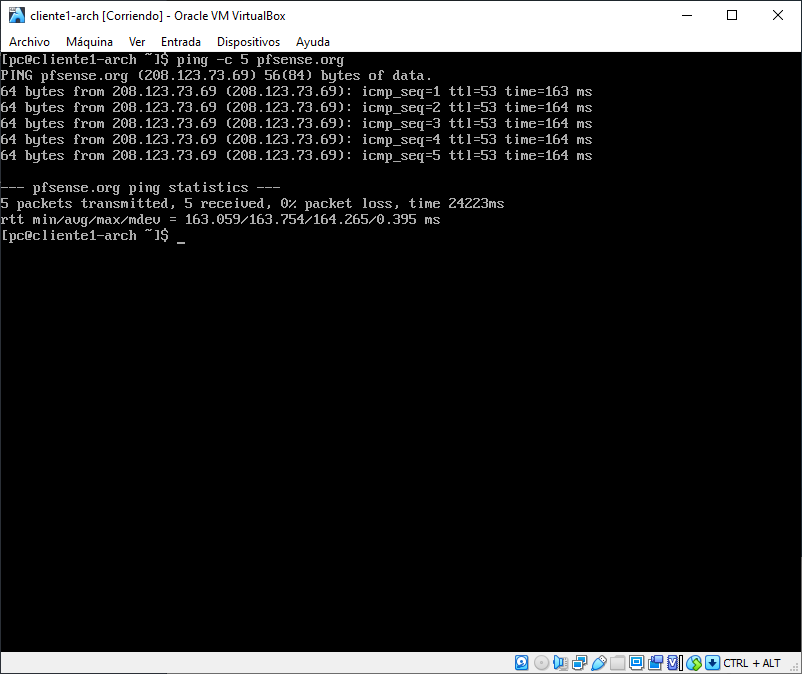

## Solución de problemas
De todos modos, en este punto que ya estamos probando la conexión a internet, nos estamos dando cuenta de que va estúpidamente lenta al comienzo, como si el firewall se estuviese interponiendo, o algo estuviese previniendo las primeras conexiones funcionar bien, por lo que decidimos cambiar la interfaz principal de pfSense de *NAT* a *Adaptador Puente*, y bajamos las CPUs de la máquina virtual de 2 a 1, como ya aparecen actualizados en la [configuración de la máquina pfSense](###Configuración-de-la-máquina-virtual). También nos damos cuenta de que 4GB de RAM son innecesarios, y le bajamos a 1GB.

Por otro lado, parecía que el DNS Forwarder que tambien hemos configurado previamente para descartar posibles "puntos lentos", no esté funcionando de forma adecuada, lo cual se puede solventar eliminando las cachés de systemd-resolved, con el comando `sudo systemd-resolve --flush-caches`. Tras esto y como estamos en un escenario de pruebas, vamos a dejar activo el DNS Forwarder, ya que parece que el rendimiento de la red mejora un montón con respecto al DNS server, y aún por encima nos permite direccionar los hosts por DHCP, que es prácticamente todo lo que necesitamos con respecto al DNS para este trabajo.

Con todas estas configuraciones intentando corregir el error comentado anteriormente de la baja velocidad que se obtiene, parece que efectivamente se ha solucionado el problema.

# Configuración del Portal Cautivo
Para configurar un portal cautivo básico es realmente sencillo, debemos acceder a la interfaz web de pfSense y dirigirnos a:
- Services
  - Captive Portal
    - Add
      - Zone name *clientes*
      - Zone description *Portal cautivo para los clientes de nuestro supermercado*

Una vez creado el portal cutivo, nos lleva a la página de configuración del mismo, en el que vemos el siguiente aviso:

```Don't forget to enable the DHCP server on the captive portal interface! Make sure that the default/maximum DHCP lease time is higher than the hard timeout entered on this page. Also, the DNS Forwarder or Resolver must be enabled for DNS lookups by unauthenticated clients to work.```

Como en nuestro caso ya tenemos habilitado el DHCP en la interfaz OPT1, solamente tendremos que prestar atención a la segunda parte del mensaje más adelante.

- Hacemos click en *Enable Captive Portal*
  - Interaces *OPT1*
  - Maximum concurrent connections *100*
  - Idle timeout *60*
  - Hard timeout *240*

Tenemos muchos más ajustes disponibles, como por ejemplo logos personalizados (donde podríamos poner el logo de nuestro supermercado... etc)

En Authentication
  - Authentication Method: por el momento pondremos *None, don't authenticate users*, ya que esta es una primera aproximación, y querremos verificar que funciona. Posteriormente usaremos RADIUS.

Y bajamos al fondo de la página, donde presionamos 
  - 💾 *Save*

## Configuración de DHCP lease time
Ahora tenemos que ir a configurar la segunda parte del mensaje, el DHCP lease time, que no puede ser menor que el Hard timeout del portal cautivo. Para ello:
- Services
  - DHCP Server
    - OPT1
      - Other Options
        - Default lease time *14400*
    - 💾 *Save*  

## Testeo del Portal Cautivo
Y para probar que funciona, volveremos a uno de los dos clientes, abriremos Firefox, e intentaremos acceder a cualquier página web. Si todo va bien, pfSense nos interceptará y pedirá logueo, que en nuestro caso básico será únicamente un botón de login sin credenciales, como se ve en la imagen siguiente:

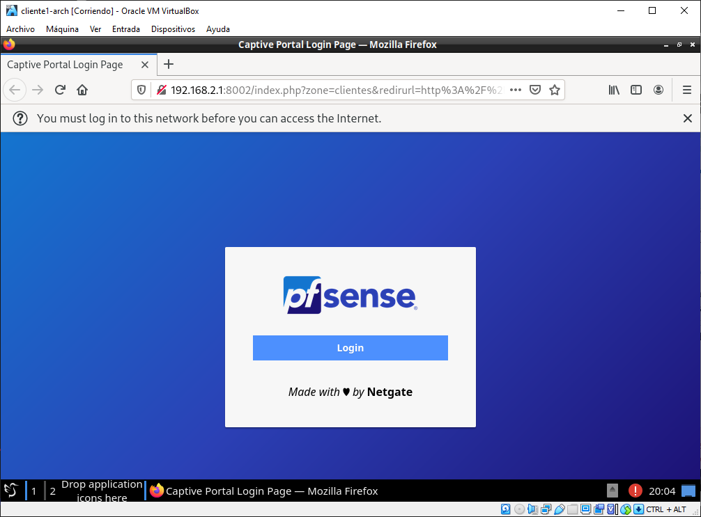

A parte de poder efectivamente ver que funciona internet, si accedemos a
- Status
  - Captive Portal

podremos ver los usuarios logueados, como se ve en la imagen a continuación:

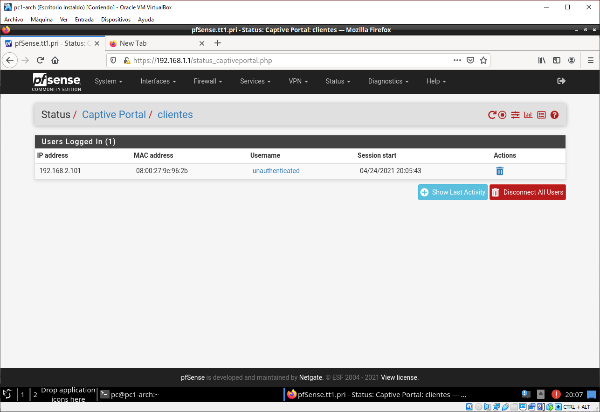

# Autenticación por RADIUS
## Instalación de soporte de freeradius en pfSense
Tras configurar correctamente el portal cautivo sin autenticación, deberemos configurar pfsense para que autentique contra un servidor freeradius. Para esto navegaremos la web UI tal que:
- System
  - Package Manager
    - Available Packages
      - Search *Buscamos por "radius"*
      - Seleccionamos freeradius3 -> *Install*
      - Confirmamos

En el proceso de instalación nos saldrá una pantalla como esta, esperamos pacientemente.

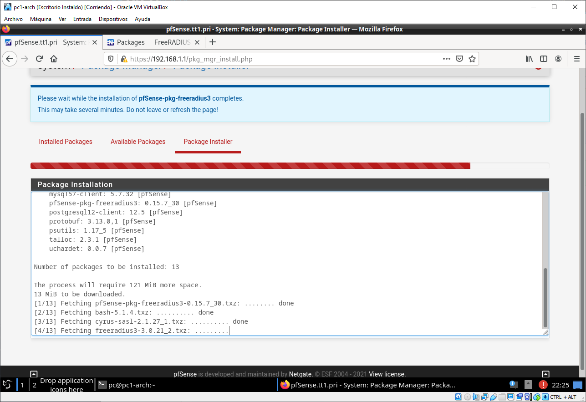

Una vez terminada la instalación, hacemos como nos indica la consola y vamos a Services -> FreeRADIUS.

También nos indica
```EAP certificate configuration is required before using the package. Visit System > Cert. Manager and create a CA and a server certificate. After that, visit Services > FreeRADIUS > EAP tab and complete the 'Certificates for TLS' section (and, optionally, also the 'EAP-TLS' section.)``` Esto lo guardaremos para luego.

## Instalación de OpenLDAP en srv1-arch
Para instalar OpenLDAP en el servidor procederemos con los siguientes comandos:

```bash
sudo pacman -S openldap
```

## Configuración de OpenLDAP en srv1-arch
### Configuración inicial
Ahora procederemos a configurar el servidor openldap. Por comodidad los siguentes comandos se ejecutan como root (`sudo su`).

La configuración de servidor de openldap se encuentra en `/etc/openldap/slapd.conf`. La editaremos tal que:
- Cambiamos el campo `suffix` a `"dc=tt1,dc=pri"`. Esto indica nuestro sufijo, que suele ser (y en nuestro caso es) el dominio.
- El campo `rootdn` a `"cn=root,dc=tt1,dc=pri"`. Esta línea indica básicamente el administrador, el cual en nuestro caso será root.
- Al inicio del fichero, en la zona de includes añadiremos
```
include         /etc/openldap/schema/cosine.schema
include         /etc/openldap/schema/inetorgperson.schema
include         /etc/openldap/schema/nis.schema
```

Tras realizar todo esto guardamos, y ejecutaremos los siguientes comandos, el primero para eliminar la contraseña de root actual, y el segundo para escribir al archivo la password hasheada de root. De nuevo, esta no destaca por su complejidad, pero es solamente a efectos de demostración.
```bash
sed -i "/rootpw/ d" /etc/openldap/slapd.conf
echo "rootpw     $(slappasswd -s pc1234)" >> /etc/openldap/slapd.conf
```

Preparamos el directorio de la base de datos con
```bash
cp /var/lib/openldap/openldap-data/DB_CONFIG.example /var/lib/openldap/openldap-data/DB_CONFIG
```

#### Configuración del cliente en el propio servidor (para labores de administración)
Para esto configuraremos el archivo `/etc/openldap/ldap.conf`
- Descomentamos el campo `BASE` y lo ponemos a `"dc=tt1,dc=pri"`.
- Descomentamos el campo `URI` y lo ponemos a `ldap://192.168.1.200 ldap://192.168.1.200:666`


### Binding DHCP estático
Ahora tenemos un problema: Nuestra IP se obtiene por DHCP, así que por el momento y en este caso únicamente, tenemos la IP .106, por lo que hay que realizar una configuración de IP estática. Para esto podemos editar el archivo `/etc/systemd/network/20-wired.network`, pero como nos sigue interesanto utilizar DHCP, otra cosa que podemos hacer es realizar un binding estático de DHCP. 

Desde la webUI de pfSense vamos a:
- Services
  - DHCP Server
    - LAN
      - DHCP Static Mappings for this Interface
        - Add
          - MAC Address (la MAC de `srv1-arch`). En mi caso *08:00:27:C4:3B:B1*
          - Client Identifier. No es muy relevante, pero en mi caso pondré *Servidor 1 Arch*
          - IP address *192.168.1.200*
          - Hostname *srv1-arch
        - 💾 *Save*  
      - *Apply Changes*

Ahora en `srv1-arch` reiniciamos la red con `sudo systemctl restart systemd-networkd`

### Activación del servicio
Tras configurar todo adecuadamente, nos falta activar e iniciar el servicio con `sudo systemctl enable --now slapd.service`

### Creación de la entrada inicial
Ahora que tenemos iniciado el servicio, y el cliente está configurado, podemos crear la entrada inicial, así como el grupo de usuarios. Para ello creamos el el siguiente archivo `firstent.ldif`:
```ldif
dn: dc=tt1,dc=pri
objectClass: dcObject
objectClass: organization
dc: tt1
o: tt1
description: TT1 directory

dn: cn=root,dc=tt1,dc=pri
objectClass: organizationalRole
cn: root
description: TT1 Directory Manager

dn: ou=users,dc=tt1,dc=pri
objectClass: organizationalUnit
objectClass: top
ou: users
```

Y realizamos la transacción con el comando:
```bash
ldapadd -c -x -D 'cn=root,dc=tt1,dc=pri' -W -f firstent.ldif
```

Introducimos la contraseña de LDAP `pc1234` y aceptamos.

## Instalación de jxplorer en pc1-arch
Para instalar jxplorer: el software que usaremos para gestionar el servidor LDAP, necesitaremos bajar su paquete del AUR (Arch User Repository), para lo cual no es necesario pero sí conveniente un AUR helper. En esta ocasión utilizaremos `yay`.

Para instalar yay, procederemos tal que:
```bash
sudo pacman -S git
git clone https://aur.archlinux.org/yay-bin.git
cd yay-bin
makepkg -sri
cd ..
sudo rm -rf yay-bin
```

Y tras tener yay instalado, procederemos a instalar jxplorer y java. En el diálogo que nos pregunta `Remove make dependencies after install? [y/N]`, respondemos que si [`y`]. Tras eso simplemente pulsamos \<ENTER\> para aceptar todo por defecto.
```bash
yay -S jdk8-openjdk jxplorer
```

## Inserción de usuarios desde jxplorer
Para testear el correcto funcionamiento del servidor LDAP, vamos a insertar un usuario a mano en jxplorer.

Nos dirigiremos a jxplorer en `pc1-arch` -> File -> Connect
- Host *192.168.1.200*
- Base DN *dc=tt1,dc=pri*
- Security
  - Level: *User + Password*
  - User DN: *cn=root,dc=tt1,dc=pri*
  - Password: *pc1234*

Si lo creemos conveniente podemos guardar el perfil. En nuestro caso lo haremos.

### Inserción del usuario Cliente 1
Para insertar el usuario Cliente 1, y una vez estamos autenticados, nos dirigiremos a users, le daremos click derecho, new, y rellenaremos los siguientes datos, como también se muestra en la imagen posterior para Cliente 2.

- Parent DN: *ou=users,dc=tt1,dc=pri* (este ya debería venir automáticamente)
- Enter RND: *cn=Cliente 1*
- Selected Classes: *organizationalPerson*, *person*, *top*

Y pulsamos *OK*

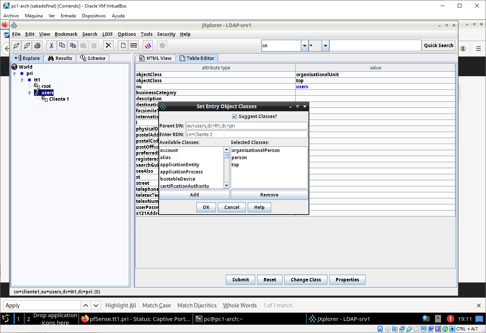

En el formulario que se nos abre, deberemos rellenar:
- **sn**: *cliente1* (surname, a pesar de que en nuestro contexto un apellido no tiene mucho sentido, aprovecharemos para poner el nombre de usuario, ya que es obligatorio cumplimentar este campo)
- **userPassword**: `cliente1` (la contraseña será *cliente+"número de cliente"*)
  - Algoritmo de cifrado *MD5*

Tras esto pulsamos en *Submit*.

### Inserción de otros usuarios en bulk
Como vemos que ha funcionado, ahora vamos a insertar una mayor base de datos en bulk con un fichero ldif.

Escribimos el script que escriba el fichero `users.ldif`. En este caso le llamaremos `createusers.sh`, y lo usaremos para crear los usuarios del 2 al 100.
```bash
#!/bin/bash

echo -n > users.ldif

for i in {2..100}; do
  echo dn: cn=Cliente $i,ou=users,dc=tt1,dc=pri >> users.ldif
  echo objectClass: organizationalPerson >> users.ldif
  echo objectClass: person >> users.ldif
  echo objectClass: top >> users.ldif
  echo sn: cliente${i} >> users.ldif
  echo userPassword: $(slappasswd -h {MD5} -s cliente$i) >> users.ldif
  echo cn: Cliente $i >> users.ldif
  echo "" >> users.ldif
done  
```

Y lo ejecutamos con `bash createusers.sh`

Tras escribir el comando lo ejecutamos con
```bash
ldapadd -c -x -D 'cn=root,dc=tt1,dc=pri' -W -f users.ldif
```

## Configuración de LDAP como servidor de usuarios en pfSense
En la web UI de pfSense vamos a:
- System
  - User Manager
    - Authentication Servers
      - Add
        - Server Settings
          - Descritptive name *Servidor OpenLDAP en srv1-arch*
          - Type *LDAP*
        - LDAP Server Settings
          - Hostname or IP address *192.168.1.200*
          - Transport *Standard TCP* Por el momento vamos a usar TCP estándar. En una próxima iteración configuraremos TLS en el servidor OpenLDAP para que todo el tráfico vaya encriptado.
          - Level *Entire Subtree*
          - Base DN *dc=tt1,dc=pri*
          - Authentication containers *ou=users,dc=tt1,dc=pri*
          - Bind anonymous [ ]
            - Bind credentials *cn=root,dc=tt1,dc=pri* , *pc1234*
          - User naming attribute *sn*
          - UTF8 Encode [x] UTF8 encode LDAP parameters before sending them to the server.
      - 💾 *Save*

## Condiguración del Portal Cautivo para que autentique contra el servidor LDAP
En la web UI de pfSense:
- Services
  - Captive Portal
    - Clientes -> Edit (✏️)
      - Authentication
        - Authentication Method
          - Use an Authentication backend
            - Authentication Server
              - *Servidor OpenLDAP en srv1-arch*
            - Secondary authentication Server
              - *lo dejamos vacío*
      - 💾 *Save*

### Probamos configuración en cliente1-arch
Para probar que funciona, volveremos a uno de los dos clientes, abriremos Firefox, e intentaremos acceder a cualquier página web. pfSense nos intercepta y pide esta vez logueo, pero esta vez con credenciales. En ella cumplimentamos los datos, como se ve en la imagen siguiente:

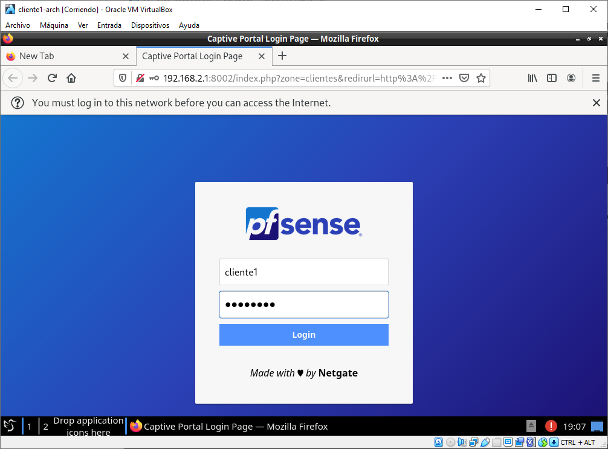

Y como podremos observar, Firefox nos muestra un mensaje de `success`, y ya podremos navegar por Internet.

Además, si vamos a
- Status
  - Captive Portal

Podremos ver la sesión recién iniciada por cliente1.

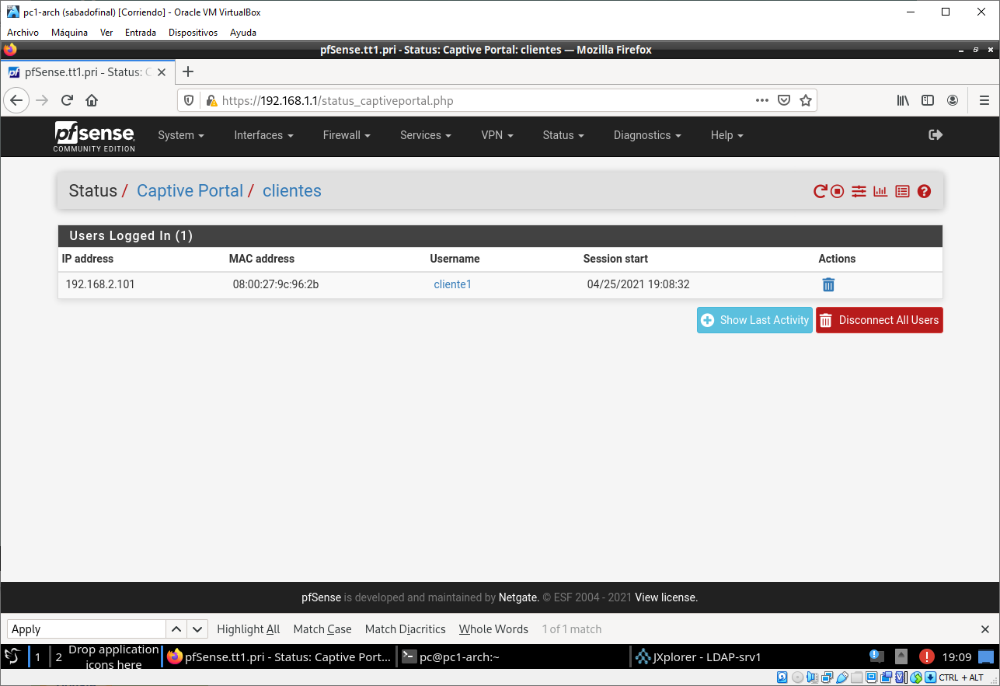